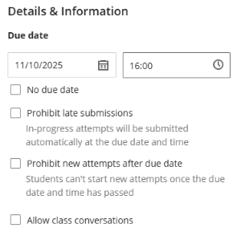

---
tags:
    - Assessment
    - Interactive content
    - Ultra
---

# Test

!!! Summary

    Test is a quiz and exam tool with a wide range of uses from informal knowledge checks to summative exams. It is best used for 'right answer' questions with closed answer options or short text input.

    This guide covers how to create and set up a Test, and is primarily aimed at **teaching staff**.

!!! principle "Relevant [VLE site design principles](../ultra/site-design-principles.md)"

    - 3.4 Essential: Site and materials content is accessible.
    - 4.1 Essential: The assessment section contains all information about module assessments.
    - 4.2 Essential: Assessment instructions are clearly labelled and explain the task and requirements.

## Uses of Test

!!! Tip

    If your intended usage involves long written answers or file uploads, another tool will likely be more appropriate.

!!! Warning

    To run a formal exam using Test, you **must** [contact us](mailto:vle-support@york.ac.uk) well in advance to set up and manage the exam procedure. 

Test has a lot of flexible features, so is useful in many situations, including:

-   **Knowledge check**

    ---
    
    - Very short: 1-3 auto-marked questions only.
    - Check understanding or track completion of specific content.
    - Can also [add questions directly to a Document page](../ultra/documents.md#block-knowledge-check)

-   **Practice quiz**

    ---

    - Optional formative practice of module content.
    - Auto-marked questions only.
    - No specific time to complete.
    - Unlimited attempts.

-   **Low-stakes summative quiz**

    ---

    - Very low-stakes (eg: 2% of grade).
    - Auto-marked questions only.
    - No specific time to complete.
    - Usually allow up to 3 attempts.

-   **Formal summative exam**

    ---

    - Scheduled exam during CAP or other assessment period.
    - Requires a separate exam site.
    - Very specific settings required: DET will manage this.

Find out more about how Test has been used across the University:

??? case-study "Case study: Ultra Test for practice quizzes [Language & Linguistic Science]"

    Ellie Rye provides a walkthrough of the 'Structure of English' Ultra site, describing how they applied the Ultra template to present teaching content, and reflects on the use of Discussions and Tests for formative practice quizzes.

    Watch their presentation:<iframe src="https://york.cloud.panopto.eu/Panopto/Pages/Embed.aspx?id=affd8a23-7d50-4d21-87d0-b15600b04234&autoplay=false&offerviewer=true&showtitle=false&showbrand=false&captions=false&interactivity=all" height="405" width="720" style="border: 1px solid #464646;" allowfullscreen allow="autoplay" aria-label="Panopto Embedded Video Player" aria-description="Ellie Rye, LLS, Structure of English" ></iframe>

    [Structure of English (Panopto viewer)](https://york.cloud.panopto.eu/Panopto/Pages/Viewer.aspx?id=affd8a23-7d50-4d21-87d0-b15600b04234) (8 mins 21 secs, UoY log-in required)

    See the [full case study for more details and the transcript](../training/case-studies/lls-rye.md).
    You can also browse our [full set of case studies](../training/case-studies/index.md).

??? case-study "Case study: Ultra Test for formative and summative assessment [Computer Science]"

    Tommy Yuan shares his experiences of using the Ultra test tool for formative and summative assessment. Topics include how it can save time for lecturers and administrators, and reduce the likelihood of collusion and academic misconduct.

    Watch their presentation:<iframe src="https://york.cloud.panopto.eu/Panopto/Pages/Embed.aspx?id=0ed26b92-2446-45e4-9815-b141010d308f&autoplay=false&offerviewer=true&showtitle=false&showbrand=false&captions=false&interactivity=all" height="405" width="720" style="border: 1px solid #464646;" allowfullscreen allow="autoplay" aria-label="Panopto Embedded Video Player" aria-description="Tommy Yuan: VLE Test for assessment" ></iframe>

    [VLE Test for assessment (Panopto viewer)](https://york.cloud.panopto.eu/Panopto/Pages/Viewer.aspx?id=0ed26b92-2446-45e4-9815-b141010d308f) (6 mins 59 secs, UoY log-in required)

    See the [full case study for more details and the transcript](../training/case-studies/cs-yuan.md).
    You can also browse our [full set of case studies](../training/case-studies/index.md).

## Considerations

### Accessibility

There are some particular accessibility considerations when creating Test questions, along with [all the usual accessibility considerations](../accessibility/index.md).

#### Images and figures

Images and figures used in Test questions must have an appropriate text-based alternative of the information:

- simple images: add ALT text describing the key information to answer the question.
- complex images: provide a separate text description (eg. data in table format, description of a diagram etc.). This can be uploaded to the question as a separate file.

For more details and guidance, see our [General advice on ALT text](https://subjectguides.york.ac.uk/media/images#s-lg-box-wrapper-18695081) and [advice on describing complex images](https://www.learningapps.co.uk/moodle/xertetoolkits/play.php?template_id=3023#page1)

<figure markdown>

<figcaption>ALT text describing a simple figure in an MCQ</figcaption>
</figure>

#### Content visibility

Make sure that the content needed to answer a question can be easily viewed on screen. Avoid requiring students to scroll through dropdowns, or other situations where they can't see all of the relevant question content at once.

Some particular considerations:

- Students may be taking the Test on a laptops or or other small screen, so trial your test in Student Preview mode to make sure content can be easily seen on a small screen.
- If using images in Matching questions, put images inside the Prompt, not the Answer portion. This means students can see all the answer options together for each image. If  images are the answer options, students must scroll through the drop down to see them all. This makes it difficult to compare images, especially if they are similar.

<figure markdown>

<figcaption>Considering content visibility during question design</figcaption>
</figure>

??? Abstract "Image descriptions: Accessible question examples"

    **Example 1: Multiple-choice question with a simple figure and ALT text**

    Question text: This scatterplot shows the relationship between two variables. What is the correlation shown?

    ALT text for the scatterplot: As x increases, y increases. Points are tightly distributed on a straight line.

    Answer options: strong positive correlation, weak positive correlation, no correlation, weak negative correlation, strong negative correlation

    **Example 2: Matching figures to text descriptions**

    A matching question where scatterplots of showing correlations are matched to the text description (strong positive correlation, weak positive correlation, no correlation, weak negative correlation, strong negative correlation).

    Question text: For each scatterplot, select the correlation shown.

    Good practice: Scatterplots are the Prompts, so can all be seen and compared on the main page without scrolling. The text-based descriptions appear in an Answers drop-down list next to each scatterplot. These are text descriptions and can all be seen at once without scrolling.

    Poor practice: Text descriptions are the Prompts, appearing in a short list. The scatterplots appear in an Answers drop-down list next to each description. Students must scroll through the plots, with only two of the plots visible at once.

### Randomisation

Randomisation is a very useful tool for creating robust assessments, particularly in remote settings (limits collusion opportunities). There are various randomisation methods, which can be combined:

??? Abstract "Random order: Test presentation options"

    <figure markdown>
    
    <figcaption>The same content is shuffled</figcaption>
    </figure>

    The overall Test settings contain three options to randomise the order of test content. These appear in the *Presentation Options* section.

    **Questions**
    
    - Randomises the order of all questions in the Test.
    - If pages used, questions are randomised within the page.
    - Questions must be able to appear in any order (ie. do not refer to earlier questions).
    
    **Answers**
    
    - Randomises the order of MCQ answer options.
    - Don't use 'all of the above' type answers; set multiple correct answers instead. 
        
    **Pages**
    
    - Randomises the order of sections (pages) within the Test.
    - Must define pages by adding page breaks between relevant questions.
    - Combine with *random question order* to also randomise questions within pages.
    - Tick *Do not randomise first page* to pin particular content to the start of the Test.

??? Abstract "Random question selection: Question pools"

    <figure markdown>
    
    <figcaption>Question pool diagram</figcaption>
    </figure>

    !!! Tip
    
        For fair and valid assessment, all questions within a pool must be of equivalent difficulty, and ideally also the same question type (eg. all multiple-choice). To include questions at different levels or points values, use multiple pools.
    
    Use Question pools to randomly draw a subset of questions from a larger pool of similar questions so that different, but equivalent, questions are presented in each attempt. This is useful for quizzes taken multiple times and for reducing the opportunity for collusion in formal exams.
    
    Within each pool, questions assess the same or similar concepts at an equivalent difficulty level, so it doesn't matter which particular question is drawn. The question pools differ to each other based on factors such as:
    
    - topic: Week 1, Week 2, Week 3 etc.
    - difficulty level: easy, medium, hard
    - cognitive tasks: remember, understand, apply etc.
    
    The example in the diagram above has three question pools. For each attempt, two questions are randomly selected from each pool, giving six questions in total. There are six possible combinations of two questions from the three pools, giving 216 possible combinations for the six questions in total.
    
    Even for the small question pools in this example it's likely that each attempt/student will receive a unique question set. However, in practice question pools are larger than this for increased robustness and repeatability; we recommend around 5 questions in the pool per question drawn for the Test.

<!-- See our [Question pools & banks guide](www.google.com) for more details on setting this up effectively. -->

??? Abstract "Random formula values: Calculated Formula question type"
    
    <figure markdown>
    
    <figcaption>Questions use different values for the same formula</figcaption>
    </figure>
    
    The [**Calculated Formula**](https://help.blackboard.com/Learn/Instructor/Ultra/Tests_Pools_Surveys/Question_Types/Calculated_Formula_Questions) question type generates multiple versions of the question with randomly selected formula values.
    
    Students use the same formula with different input values for each question version, which therefore have different correct answers. This is useful for robust assessment where the focus is on correctly performing the calculation, rather than a specific outcome.
    
    For example:

    - *Question formula*: Mug A holds **[x] ml** of tea, and mug B holds **[y] ml**. What is the total volume of tea?
    - *Generated values*:
        - Student 1: Mug A holds **358 ml** of tea, and mug B holds **267 ml**. What is the total volume of tea?
        - Student 2: Mug A holds **544 ml** of tea, and mug B holds **458 ml**. What is the total volume of tea?

    

### Anonymity

!!! Warning 

    Anonymous marking makes it much harder to administer the Test, so avoid anonymity and manually marked *Essay* question types unless absolutely necessary.

For any Test that contains only auto-marked questions, there is no need for anonymity. Anonymity is only required for summative exams with manually marked *Essay* question types; we don't recommend anonymity for any formative exams.

If anonymous marking is on for the Test, you:

- can't see who has submitted/started; this makes it hard to manage exam access
- can't download answers/results/scores until results are de-anonymised

## Create a Test

!!! Tip

    Consider the appropriate location for the Test; with weekly content (specific content) or in the Assessment section (general content or formal assessment). 

To create a Test:

1. Hover where the Test should appear. Click the plus icon, then **Create**, then select **Test**.
2. Enter a descriptive **name** at the top left. 
3. Click the plus icon to add **questions** (see Test questions section below).
4. Set a **Due date** within work hours and adjust other settings as needed (see Test settings section below).
5. Once confident that the Test is ready, set it as **Visible to students** or specify  **Release conditions** in the top right (see our guide to [Content visibility](../ultra/content-visibility.md) for more detail).

You can build and trial the Test in your personal Ultra sandpit site, and when it is ready use the [Copy Content tool](../ultra/copy-content.md) to add it to your module/exam site in the relevant location.

## Questions

!!! Tip

    Don't use *Essay* type questions for practice quizzes or other Tests that need automatic mark return. Essay questions must be manually marked before scores are visible for any question in the Test.

### Question types

Key question types are summarised below. See [Blackboard's Question Types guide](https://help.blackboard.com/Learn/Instructor/Ultra/Tests_Pools_Surveys/Question_Types) for details of the various other question types available. 

| Question type | Description | Grading type | AI generation |
| ----------- | ----------- | ----------- | ----------- |
| [Multiple Choice](https://help.blackboard.com/Learn/Instructor/Ultra/Tests_Pools_Surveys/Question_Types/Multiple_Choice_Questions)  | Pick a single correct answer from options given. | auto graded | can be auto-generated |
| [Multiple Answer](https://help.blackboard.com/Learn/Instructor/Ultra/Tests_Pools_Surveys/Question_Types/Multiple_Answer_Questions)  | Pick multiple correct answers from options given. Can give partial or negative credit. | auto graded | manual only |
| [Fill in the Blank](https://help.blackboard.com/Learn/Instructor/Ultra/Tests_Pools_Surveys/Question_Types/Fill_in_the_Blank_Questions) | Input the missing word(s) in the given text. Answer can be exact or match a pattern | auto graded | can be auto-generated |
| [Matching](https://help.blackboard.com/Learn/Instructor/Ultra/Tests_Pools_Surveys/Question_Types/Matching_Questions)| Match corresponding items from two groups. Can give partial or negative credit. | auto graded | can be auto-generated |
| [Calculated Formula](https://help.blackboard.com/Learn/Instructor/Ultra/Tests_Pools_Surveys/Question_Types/Calculated_Formula_Questions)  | Calculate the answer to a given formula (eg. 3x + 4y = ?). Values (x/y) are randomly generated so each student has a different question.| auto graded | manual only |
| [Calculated Numeric](https://help.blackboard.com/Learn/Instructor/Ultra/Tests_Pools_Surveys/Question_Types/Calculated_Numeric_Questions)  | Similar to Fill in the Blank questions, but for numeric answers. Answer can be exact number or within a range.| auto graded | manual only |
| [Essay](https://help.blackboard.com/Learn/Instructor/Ultra/Tests_Pools_Surveys/Question_Types/Hotspot_Questions)  | Enter a text response (of any length). Can provide a model answer for help grading. | **manually graded** | can be auto-generated |

### Add questions

There are multiple ways to add questions to a Test. Which method is most appropriate depends on the amount of questions to add, whether to display all questions or a random subset, and whether questions have already been added elsewhere in the site.
 
??? Abstract "Manually add questions"

    Add questions individually within the Test interface. You may find it helpful to draft your questions in another document first.

    1. Click the **plus + icon**.
    2. Select the relevant question type.
      
    3. Enter the question and answers as needed for that question type (see the linked guides in the [Question Types section](#question-types) for more information)
    4. Optional question settings (availability depends on question type):
        - set partial or negative credit for different answers
        - set the question as extra credit
        - add automated feedback
        - change the points awarded (default = 1 point)
         
    5. Click **Save**.
    6. Repeat for all questions.

??? Abstract "Auto-generate questions with AI"

    Use the [AI Design Assistant Tool](../ultra/ai-da.md) to auto-generate key question types based on your site content. See [Question types](#question-types) above for the supported types.

    !!! ai "Using AI tools effectively"

        AI-generated content is a **starting point** for your own content development rather than a finished product. You must always **carefully check** output for accuracy and appropriacy and adapt as needed.

        See our [general guide to Artificial Intelligence tools](../other-tools/ai.md) for more details on using AI responsibly.

    1. Create a Test or open an existing Test or Question Bank. To generate a new Question Bank, select **Auto generate** and skip step 2.
    2. Click the **plus icon** where you would like the question(s) to appear, and select **Auto-generate question**.
      
    3. Define the questions:
        - Enter a **Description** and/or **Select course items** to help generate more relevant questions.
        - Select the **Question type** to generate. *Inspire me!* will generate a mix of question types.
        - Set the **Complexity** level and choose how many questions to create.
    4. Click **Generate**.
    5. Review the questions. Select which question(s) to include, or repeat steps 3 and 4 to generate new questions.
    6. Click **Add to Assessment**.
    7. Carefully check the questions for accuracy and appropriacy and edit as needed. 

    If course items are selected to provide context, questions may be based on procedural instructions within an item. If this occurs, you may find it more effective to instead provide a detailed description of the desired content.

    

    ??? Abstract "Test questions: interface and examples of generated content"

        **Description:** focus on navigation techniques and appropriate ways to use them

        **Select course items**: none selected

        **Question type**: Multiple choice

        **Complexity:** level 7/10

        **Number of question**: 4 (maximum 10)

        **Content generated:**

        *Question 1.* Which of the following is an advisable way to navigate safely in poor visibility?

        - A. Pacing and timing to estimate distance travelled [Correct answer]
        - B. Relying solely on GPS for directions
        - C. Running at full speed to get through the fog quickly
        - D. Following random sheep tracks

        Further questions are not visible on this screen, scroll to reveal.

??? Abstract "Upload questions from a file"

    Draft questions in a spreadsheet and **upload them in .tsv format** to your Test. This is helpful to import lots of questions quickly.

    To use optional question settings (eg. partial credit), first upload your file and then manually update each question.

    **Prepare the file**

    1. Make a copy of the [Ultra tsv template for Tests Google Sheet](https://docs.google.com/spreadsheets/d/17G_QC4bgFbiLmgIFyIl-jOfLbLLFr8yAxCMF3flwGoM/copy)
    2. Enter your questions by editing the *BB test* tab (contains examples of the formatting required for each question type).
     
    3. Download the questions in .tsv format: File > Download > Tab-separated values (.tsv)

    **Upload the file**

    1. Return to the Test and click the **plus + icon**.
    2. Select **Upload questions from file**.
     
    3. Select your .tsv file.
    4. Once the upload is processed, review the status message for any errors.

    For more details and examples of the required file format, see [Blackboard's guide to uploading questions](https://help.blackboard.com/Learn/Instructor/Ultra/Tests_Pools_Surveys/Reuse_Questions/Upload_Questions).

??? Abstract "Reuse questions"

    Add questions that already appear in another Test or Question Bank in the site. This **copies questions**, so any edits made to re-used questions are not updated in the original question. 

    !!! Tip

        Reusing questions will display all of the selected questions in the Test. If you want to display only a subset (eg. 2 of 10 possible questions), use a Question Pool instead.

    1. Click the **plus + icon**.
    2. Select **Reuse questions**.
     
    3. Select the questions to copy, using the filter options if needed: search by keyword, browse by source (Tests and Question Banks), browse by question type.
    4. Click **Copy questions**.
    5. Once the copy is processed, review the status message for any errors.

??? Abstract "Question pools (to draw a random subset of questions)"
 
    Build a [question pool to randomly draw a subset from in each Test attempt](#randomisation). Choose from questions that already appear in another Test or Question Bank in the site.
    
    Question pools **do not copy questions**; any edits made to questions in a pool will appear everywhere that question is used. Deleting a question from a Question pool does not delete the question in other locations.

    1. Click the **plus + icon**.
    2. Select **Add question pool**.
     
    3. Select the questions to add, using the filter options if needed: search by keyword, browse by source (Tests and Question Banks), browse by question type.
    4. Click **Add questions**.
    5. Enter the number of questions to display and optionally update the points awarded per question. Click **Save**.
     
    6. In edit mode a summary of the pool is shown where you can view the questions and edit settings. Students will see the questions pulled from the pool.
     

    For more details, see the [BlackBoard Help guide to Question pools](https://help.blackboard.com/Learn/Instructor/Ultra/Tests_Pools_Surveys/ULTRA_Reuse_Questions/Question_Pools).

    

    

    <iframe width="560" height="315" src="https://www.youtube.com/embed/6otJ5eCXf_E?si=LwxK1f6Qi858lotq" title="YouTube video player" frameborder="0" allow="accelerometer; autoplay; clipboard-write; encrypted-media; gyroscope; picture-in-picture; web-share" referrerpolicy="strict-origin-when-cross-origin" allowfullscreen></iframe>
     [Use Question Pools in Assessments in the Ultra Course View [YouTube]](https://youtu.be/cuWBxlV2FVM?si=ulkRHUN9G8-YGIWq)
    

    

### Download question paper

You can print or download your Test as a PDF, along with an automatically-generated answer key. This could be useful for archiving and sharing with external examiners, reviewers etc.

!!! Tip
    
    If Test questions are randomised, a new version is generated each time the Test is printed.

To print or save a Test:

1. Open the **Content and Settings** tab in the relevant Test. 
2. Click **Print** above the Test content.
3. Click **Print** in the pop up box.
4. The answer key (shown first) and test are generated and shown in print preview. Save as PDF or send to the printer.

## Settings

!!! Warning

    Very specific settings are required for **formal exams** using Test. You **must** [contact us](mailto:vle-support@york.ac.uk) well in advance to set up these up correctly. This guide should not be considered sufficient guidance for this use case.

Open the full assessment settings by clicking the **cog icon** at the top of the **Assessment settings** panel next to test content. This panel also includes key quick-access settings.

### Considering appropriate settings

There are many possible Test settings. This section explains the different settings to guide you to choose the appropriate settings for your specific use case. See below for suggested settings for some example use cases. 

#### Details & Information (Due date)

**Key consideration: Does your Test need a due date?**

A due date is only recommended for low-stakes summative quizzes that must be completed by a specific date.

Other use cases do not require a due date.

=== "Settings: no due date"

    - Due date: tick *No due date*
    - The next two options are not available
    - *Allow class conversations*: leave unticked

=== "Settings: with due date"

    

    

    - *Due date*: enter a due date and time (during core work hours) for low-stakes summative quizzes if required.
    - *Prohibit late submissions*: [optional] tick to automatically submit any in-progress attempts at the deadline (Note: this doesn't prevent new attempts after the deadline).
    - *Prohibit new attempts after due date*: do not tick; student must be able to submit late. tick to prevent new attempts after the deadline. ????????
    - *Allow class conversations*: leave unticked
    

    
    

### Suggested settings for example use cases

This section summarises the important settings for some key example use cases. See the section above for explanation of when it's appropriate to use specific settings.

??? Abstract "Knowledge check"

    **Suggested settings**
    
    - Details & Information
        - tick *No due date*
    - Presentation Options
        - if using LaTeX, tick *Display one question at a time* for more consistent rendering
    - Formative Tools
        - tick *Formative assessment*
        - leave *Display formative label to students* ticked
    - Marking & Submissions
        - Mark category: leave as *Test* or change to *Quiz* (this will change the icon displayed in the Course Content area)
        - Attempts allowed: set to Unlimited
        - Assessment mark: leave *Post assessment marks automatically* ticked
    - Description: add an optional short description to display under the item's name in the Course Content area.
    - Leave all other settings unticked or as the default.

??? Abstract "Practice quiz"

    !!! Tip

        Randomising questions displays **all questions** in the Test in a random order. To instead display a random subset of possible questions, use a Question Pool.

    **Suggested settings**

    - Details & Information
        - tick *No due date*
    - Presentation Options
        - if no randomisation needed: leave all unticked
        - if randomisation is needed: tick *Randomise questions*, *Randomise answers* or *Randomise pages* as desired
        - if using LaTeX, tick *Display one question at a time* for more consistent rendering
    - Formative Tools
        - tick *Formative assessment*
        - leave *Display formative label to students* ticked
    - Marking & Submissions
        - Mark category: leave as *Test* or change to *Quiz* (this will change the icon displayed in the Course Content area)
        - Attempts allowed: set to Unlimited
        - Assessment mark: leave *Post assessment marks automatically* ticked
    - Description: add an optional short description to display under the item's name in the Course Content area.
    - Leave all other settings unticked or as the default.
    
??? Abstract "Formal exam"

    It's essential that settings are correct for formal exams. This will depend on the structure of your Test and other requirements.
    
    [Contact us](mailto:vle-support@york.ac.uk) to advise on appropriate settings for your specific exam.

---

- time limit - really needed?
- deadline - allow enough time

### SSP accommodations

SSP deadline extensions or extra time allowances must be applied for summative Tests and for formal formative tests.

See our [Accommodations for SSPs guide](../ultra/accommodations.md) for instructions on how to do this.

<figure markdown>

<figcaption>Flag denoting time limit accommodation</figcaption>
</figure>

## Marking & results

### Manual marking (*Essay* type questions)

If a Test contains *Essay* type questions, these must be manually marked. This must occur before scores or feedback for auto-marked questions can be released, so Essay questions should be avoided in most cases.

1. Make sure that the Test is Hidden from students to prevent accidentally releasing marks early.
2. To open a Test submission, click the *Submissions* tab within the Test and select an attempt from the list. For other methods to access submissions, see our [guide to open Ultra Assignment submissions](../ultra/assignment-marking.md#1-open-a-submission).
 
3. Marking methods:
    - **Anonymous: mark by student**. If anonymous marking is on, Essay type questions must be marked within the full attempt. Question order will differ between attempts if randomisation was used.
     
    - **Non-anonymous: mark by question**. Click the **Questions** tab above the student list to group all the responses for each question. The question text is shown above the responses.
     
4. Review each essay question response. If an *example correct response* has been provided, click the chevron icon in the bottom right to show/hide it. Enter a score in the *mark pill* in the top right.

5. Once each essay question in an attempt has been marked, the final score is updated in the overall mark pill (on Student view).
 
6. **Anonymous marking:** once marking is complete, click **Post all marks** on the Test submissions tab to de-anonymise results.

### Student view of assessment results

Students can be allowed to view various aspects of Test results. The use case for the particular Test determines which of these it is appropriate for students to see; see the results guidance in the Settings section for more details.

| View option | What this shows | Earliest availability |
| ---------- | ---------- | ---------- |
| Submission | Questions and responses, plus overall mark (if posted) | After submission |
| Automated feedback | Feedback added for correct/incorrect answers (auto-marked questions) | After submission |
| Question score | Individual question scores | After marking |
| Correct answers | Correct answers (auto-marked questions) and Example of correct response (essay questions) | After marking |

Some considerations when using these settings:

- If the Test includes any *Essay* type questions, these must be manually marked **before** students can view any scores, regardless of when scores are released. Don't use this question type if the Test won't be manually marked.
- *Automated feedback* (auto-marked questions) and *Example of correct response* (essay questions) are only shown if this has been added to the Test questions.
- It is not possible to show correct answers to auto-marked questions without showing example of correct response for essay questions (and vice versa).

??? Abstract "What students see: MCQs"

    

    

    <figure markdown>
    
    <figcaption>MCQ: submission</figcaption>
    

    

    <figure markdown>
    
    <figcaption>MCQ: automated feedback</figcaption>
    </figure>
    

    

    <figure markdown>
    
    <figcaption>MCQ: question score</figcaption>
    </figure>
    

    

    <figure markdown>
    
    <figcaption>MCQ: automated feedback & question score</figcaption>
    </figure>
    

    

    <figure markdown>
    
    <figcaption>MCQ: correct answers - correct question</figcaption>
    </figure>
    

    

    <figure markdown>
    
    <figcaption>MCQ: correct answers - incorrect question</figcaption>
    </figure>
    

    

??? Abstract "What students see: Essay questions"

    

    

    <figure markdown>
    
    <figcaption>Essay: submission</figcaption>
    </figure>
    

    

    <figure markdown>
    
    <figcaption>Essay: question score</figcaption>
    </figure>
    

    

    <figure markdown>
    
    <figcaption>Essay: correct answers - correct question</figcaption>
    </figure>
    

    

    <figure markdown>
    
    <figcaption>Essay: correct answers - partially correct question</figcaption>
    </figure>
    

    

### Download results and question scores

After the exam, you can also download overall results or by-question scores. See our [guide to downloading Gradebook data](../ultra/gradebook.md#download--view-gradebook-data) for details of how to do this.