---
tags:
    - Assessment
    - Interactive content
    - Ultra
---

# Test

!!! Summary

    Test is a quiz and exam tool with a wide range of uses from informal quizzes to summative exams. This guide covers how to create and set up a Test, and is primarily aimed at **teaching staff**.

!!! principle "Relevant [VLE site design principles](../ultra/site-design-principles.md)"

    - 3.4 Essential: Site and materials content is accessible.
    - 4.1 Essential: The assessment section contains all information about module assessments.
    - 4.2 Essential: Assessment instructions are clearly labelled and explain the task and requirements.

## Uses of Test

!!! Tip

    If your intended usage involves long written answers or file uploads (especially where this needs to be anonymous), another tool will likely be more appropriate.

Test is best used for tasks with 'right answer' questions and automatic marking, although it can include manually marked Essay-type questions with short open text input.

This section summarises some common uses of Test. See later sections for more detail on specific aspects of building and implementing a Test.

### Practice quiz

A formative quiz that can be taken many times, usually to practice specific content. 

There is no deadline or timer. Marks and feedback are automatically returned immediately after submission, without direct input from module staff.

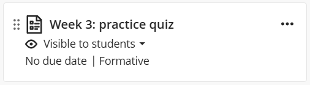

??? Abstract "Practice quiz: details & suggested settings"

    **Questions & presentation**

    - Includes auto-marked question types only.
    - Often uses [randomisation](#randomisation) to present questions in a different order in each attempt, and/or question pools to draw a random subset of questions from a larger bank of questions.
    - May use pagination to break up longer Tests or to manage question order.

    **Suggested settings**

    Leave all settings not mentioned here unticked or as the default.

    - Details & Information
        - tick *No due date*
    - Presentation Options
        - *Display one question at a time*: tick if using LaTeX to improve rendering
        - *Randomisation options*: tick *Randomise questions* and *Randomise answers*
    - Formative Tools
        - *Formative assessment*: tick to show a Formative label
    - Marking & Submissions
        - *Attempts allowed*: set to Unlimited
        - *Assessment mark*: leave *Post assessment marks automatically* ticked
    - Assessment results:
        - *Submission view*: tick, set to *after submission*
        - *Automated question feedback*: tick, set to *after individual mark has been posted*
        - *Question scores*: tick, set to *after individual mark has been posted*
        - *Correct answers*: tick, set to *after individual mark has been posted*
    - Description: add a short contextual description to display under the item's name in the Course Content area.

### Low-stakes summative quiz

A quiz or task worth a few percent (<5%) of overall grade, often related to laboratory work or as a component of continuous assessment.

May set a deadline, but does not set a time limit. The only input from module staff is usually to manually post grades and automatic feedback all together at a specific point. 

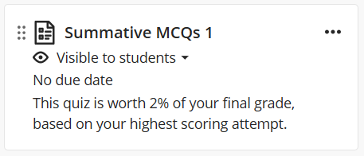

??? Abstract "Low-stakes summative quiz: details & suggested settings"

    **Questions & presentation**

    - Usually includes auto-marked question types only.
    - May use [randomisation](#randomisation) to present questions in a different order in each attempt, and/or question pools to draw a random subset of questions from a larger bank of questions.
    - May use pagination to break up longer Tests or to manage question order.

    **Suggested settings**

    Leave all settings not mentioned here unticked or as the default.

    - Details & Information
        - If no deadline in VLE: 
            - Tick *No due date*.
            - This can be easier to manage manually, especially for large cohorts.
        - If requires a deadline in VLE:
            - Set a due date and time during work hours.
            - Apply [SSP deadline extensions](#ssp-accommodations).
            - **Do not tick** the options *Prohibit late submissions* or *Prohibit new attempts after due date*. Assessment policy states that students must be able to submit work late.
    - Presentation Options
        - *Display one question at a time*: tick if using LaTeX to improve rendering
        - *Randomisation options*: tick as required.
    - Marking & Submissions
        - *Attempts allowed*: set to Unlimited, or number of attempts allowed (recommend 3+)
        - *Attempts to mark*: either set to *Last attempt* (may need to identify the last on time submission if a late submission is made) or *All attempts* then set the *Final mark calculation* as the average or highest mark.
        - *Assessment mark*: untick *Post assessment marks automatically* to manually release marks all together.
    - Assessment results:
        - *All options*: tick, set to *after individual mark has been posted* or *specific date*.
    - Description: add a short contextual description to display under the item's name in the Course Content area.

### Formal exams

!!! Warning

    To run a formal summative exam using Test, you **must** [contact us](mailto:vle-support@york.ac.uk) well in advance to set up and manage the exam procedure. This is to facilitate Test administration and comply with University assessment policy requirements.

A scheduled summative exam during CAP or other assessment period, either remotely on in-person.

Some questions may require [manual marking](#manual-marking), possibly [anonymously](#anonymity), but there are no long text answers or file uploads. Scores and feedback are released manually on a specific date. Requires a separate exam site and very specific set up; DET will manage this.

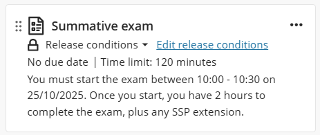

   
??? Abstract "Formal exam: summary of procedure"

    Formal exams are run very differently to asynchronous uses of Test. The appropriate set up depends on the specific exam requirements; [contact us](mailto:vle-support@york.ac.uk) to advise on your specific exam. Information here is an overview only, and **should not be considered sufficient guidance for running formal exams with Test**.
    
    **Questions & presentation**

    - Often includes auto-marked question types only, but can include some manually marked short answer questions.
    - May use [randomisation](#randomisation) to present questions in a different order in each attempt, and/or question pools to draw a random subset of questions from a larger bank of questions.
    - May use pagination to break up longer Tests or to manage question order.

    **Procedure overview**

    As an illustrative example, the general procedure for remote exams is:

    1. The Test is set up in a separate exam VLE site before the CAP.
    2. Onm exam day, students have a specific start window to begin the Test (eg. 10:00 - 10:30 am).
    3. Once each student starts, they have the full scheduled time to complete the exam plus any SSP extension (eg 2 hours + 25%).
    4. At the end of the start window, any non-starters are deemed to be absent and their access to the exam site is removed. This is much easier for non-anonymous Tests.
    5. Students manually submit when finished, or the exam automatically submits if the end of their individual timer is reached.
    6. The Test and exam site are hidden from students.
    7. Any manual marking occurs and final marks are processed.
    8. Marks and feedback are released to students at the end of the CAP.

Find out more about how Test has been used across the University:

??? case-study "Case study: Ultra Test for practice quizzes [Language & Linguistic Science]"

    Ellie Rye provides a walkthrough of the 'Structure of English' Ultra site, describing how they applied the Ultra template to present teaching content, and reflects on the use of Discussions and Tests for formative practice quizzes.

    Watch their presentation:<iframe src="https://york.cloud.panopto.eu/Panopto/Pages/Embed.aspx?id=affd8a23-7d50-4d21-87d0-b15600b04234&autoplay=false&offerviewer=true&showtitle=false&showbrand=false&captions=false&interactivity=all" height="405" width="720" style="border: 1px solid #464646;" allowfullscreen allow="autoplay" aria-label="Panopto Embedded Video Player" aria-description="Ellie Rye, LLS, Structure of English" ></iframe>

    [Structure of English (Panopto viewer)](https://york.cloud.panopto.eu/Panopto/Pages/Viewer.aspx?id=affd8a23-7d50-4d21-87d0-b15600b04234) (8 mins 21 secs, UoY log-in required)

    See the [full case study for more details and the transcript](../training/case-studies/lls-rye.md).
    You can also browse our [full set of case studies](../training/case-studies/index.md).

??? case-study "Case study: Ultra Test for formative and summative assessment [Computer Science]"

    Tommy Yuan shares his experiences of using the Ultra test tool for formative and summative assessment. Topics include how it can save time for lecturers and administrators, and reduce the likelihood of collusion and academic misconduct.

    Watch their presentation:<iframe src="https://york.cloud.panopto.eu/Panopto/Pages/Embed.aspx?id=0ed26b92-2446-45e4-9815-b141010d308f&autoplay=false&offerviewer=true&showtitle=false&showbrand=false&captions=false&interactivity=all" height="405" width="720" style="border: 1px solid #464646;" allowfullscreen allow="autoplay" aria-label="Panopto Embedded Video Player" aria-description="Tommy Yuan: VLE Test for assessment" ></iframe>

    [VLE Test for assessment (Panopto viewer)](https://york.cloud.panopto.eu/Panopto/Pages/Viewer.aspx?id=0ed26b92-2446-45e4-9815-b141010d308f) (6 mins 59 secs, UoY log-in required)

    See the [full case study for more details and the transcript](../training/case-studies/cs-yuan.md).
    You can also browse our [full set of case studies](../training/case-studies/index.md).

---

## Considerations

### Accessibility

There are some particular accessibility considerations when creating Test questions, along with [all the usual accessibility considerations](../accessibility/index.md).

Some general considerations are covered in the Digital Accessibility Team's [guide for graphic adjustments for vision-impaired students](https://docs.google.com/document/d/1_ANA76QioWT2x8k4gf27We5Ceo_T9choYLbwqkOa64Q/edit?usp=sharing). These tips are helpful for all users.

#### Images and figures: descriptions

Images and figures used in Test questions must have an appropriate text-based alternative of the information:

- simple images: add ALT text describing the key information to answer the question.
- complex images: provide a separate text description (eg. data in table format, description of a diagram etc.).

For more guidance on image descriptions for assessments:

- Our [General advice on ALT text](https://subjectguides.york.ac.uk/media/images#s-lg-box-wrapper-18695081)
- [NWEA Image description guidance for assessments (PDF)](https://www.nwea.org/uploads/2022/11/Image-Description-Guidelines-for-Assessments_NWEA_2021.pdf)
- [Higher Education advice on describing complex images](https://www.learningapps.co.uk/moodle/xertetoolkits/play.php?template_id=3023#page1)

<figure markdown>
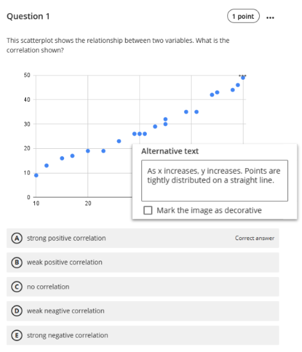
<figcaption>ALT text describing a simple figure in an MCQ</figcaption>
</figure>

#### Images and figures: colour and resolution

!!! Tip

    Colour-blindness is common and not generally disclosed. You should assume that colour-blindness considerations are needed for your Test.

Consider use of **colour** in your images and figures:

- Do not convey meaning via colour alone. For example, use different point shapes and colours for multiple factors in a figure.
- Avoid using red and green together; this is the most problematic colour combination.
- Ensure there is sufficient contrast between foreground and background colours (at least 4.5:1).
- [WhoCanUse](https://www.whocanuse.com/) is our recommended tool to check contrast and explore how colour choices can affect people with different visual impairments.

<figure markdown>

<figcaption>Using colour and shape to differentiate factors</figcaption>
</figure>

Also ensure that images and figures are **high resolution**. This prevents pixelation or blurriness when zooming in or using a screen magnifier, and improves usage for everyone.

- [Veronica with Four Eyes](https://veroniiiica.com/how-to-create-high-resolution-images-for-low-vision/) describes their experiences using images as a student with low vision, and offers tips on creating high resolution images.
- See our [Practical Guide to media editing](https://subjectguides.york.ac.uk/media/images) for more technical guidance on image resolution.

#### Content visibility

Make sure that the content needed to answer a question can be easily viewed on screen. Avoid requiring students to scroll through dropdowns, or other situations where they can't see all of the relevant question content at once.

Some particular considerations:

- Students may be taking the Test on a laptops or or other small screen, so trial your test in Student Preview mode to make sure content can be easily seen on a small screen.
- If using images in Matching questions, put images inside the Prompt, not the Answer portion. This means students can see all the answer options together for each image. If  images are the answer options, students must scroll through the drop down to see them all. This makes it difficult to compare images, especially if they are similar.

<figure markdown>
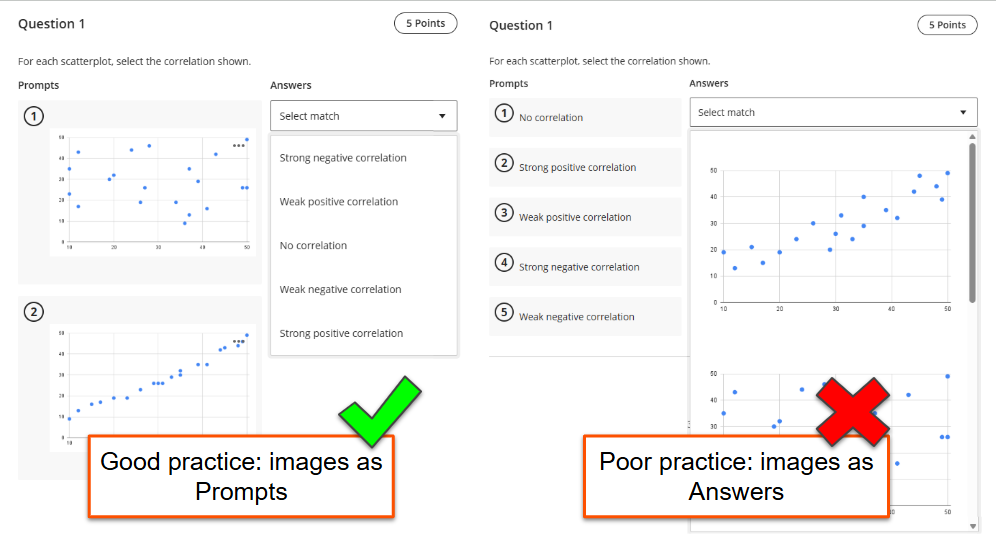
<figcaption>Considering content visibility during question design</figcaption>
</figure>

??? Abstract "Image descriptions: Accessible question examples"

    **Example 1: Multiple-choice question with a simple figure and ALT text**

    Question text: This scatterplot shows the relationship between two variables. What is the correlation shown?

    ALT text for the scatterplot: As x increases, y increases. Points are tightly distributed on a straight line.

    Answer options: strong positive correlation, weak positive correlation, no correlation, weak negative correlation, strong negative correlation

    **Example 2: Matching figures to text descriptions**

    A matching question where scatterplots of showing correlations are matched to the text description (strong positive correlation, weak positive correlation, no correlation, weak negative correlation, strong negative correlation).

    Question text: For each scatterplot, select the correlation shown.

    Good practice: Scatterplots are the Prompts, so can all be seen and compared on the main page without scrolling. The text-based descriptions appear in an Answers drop-down list next to each scatterplot. These are text descriptions and can all be seen at once without scrolling.

    Poor practice: Text descriptions are the Prompts, appearing in a short list. The scatterplots appear in an Answers drop-down list next to each description. Students must scroll through the plots, with only two of the plots visible at once.

### Randomisation

Randomisation is a very useful tool for creating robust assessments, particularly in remote settings through limiting collusion opportunities. Test has various randomisation methods, which can be combined:

??? Abstract "Random order: Test presentation options"

    <figure markdown>
    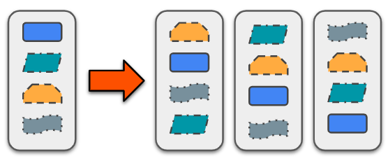
    <figcaption>The same content is shuffled</figcaption>
    </figure>

    The *Presentation Options* Test settings have three methods to randomise the order of test content:

    **Questions**
    
    - Randomises the order of all questions in the Test.
    - If pages used, questions are randomised within the page.
    - Questions must be able to appear in any order (ie. do not refer to earlier questions).
    
    **Answers**
    
    - Randomises the order of MCQ answer options for relevant questions.
    - Don't use 'A and B are correct' type answers; use 'All other options are correct' or set multiple correct answers instead. 
        
    **Pages**
    
    - If pagination is set up, this randomises the order of pages within the Test.
    - Combine with *random question order* to also randomise questions within pages.
    - Tick *Do not randomise first page* to pin the first page to the start of the Test (eg. instructions).

??? Abstract "Random question selection: Question pools"

    <figure markdown>
    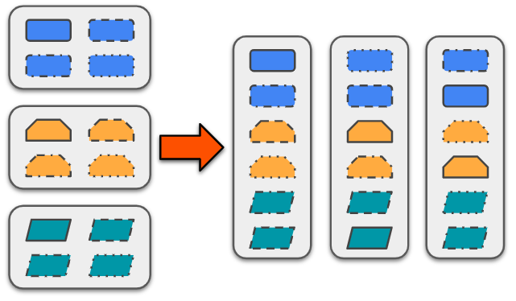
    <figcaption>Question pool diagram</figcaption>
    </figure>

    !!! Tip
    
        For fair and valid assessment, all questions within a pool must be of equivalent difficulty, and ideally also the same question type (eg. all multiple-choice). To include questions at different levels or points values, use multiple pools.
    
    Use Question pools to randomly draw a subset of questions from a larger pool of similar questions so that different, but equivalent, questions are presented in each attempt. This is useful for quizzes taken multiple times and for reducing the opportunity for collusion in formal exams.
    
    Within each pool, questions assess the same or similar concepts at an equivalent difficulty level, so it doesn't matter which particular question is drawn. The question pools differ to each other based on factors such as:
    
    - topic: Week 1, Week 2, Week 3 etc.
    - difficulty level: easy, medium, hard
    - cognitive tasks: remember, understand, apply etc.
    
    The example in the diagram above has three question pools. For each attempt, two questions are randomly selected from each pool, giving six questions in total. There are six possible combinations of two questions from the three pools, giving 216 possible combinations for the six questions in total.
    
    Even for the small question pools in this example it's likely that each attempt/student will receive a unique question set. However, larger question pools are preferable for increased robustness and repeatability; we recommend 5 questions in the pool per question drawn for the Test (ie. if each student gets 4 questions, the pool should contain around 20 questions).

??? Abstract "Random formula values: Calculated Formula question type"
    
    <figure markdown>
    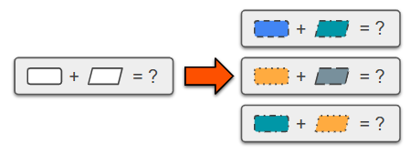
    <figcaption>Questions use different values for the same formula</figcaption>
    </figure>
    
    The [**Calculated Formula**](https://help.blackboard.com/Learn/Instructor/Ultra/Tests_Pools_Surveys/Question_Types/Calculated_Formula_Questions) question type generates multiple versions of the question with randomly selected formula values.
    
    Students use the same formula with different input values for each question version, which therefore have different correct answers. This is useful for robust assessment where the focus is on correctly performing the calculation, rather than a specific outcome.
    
    For example:

    - *Question formula*: Mug A holds **[x] ml** of tea, and mug B holds **[y] ml**. What is the total volume of tea?
    - *Generated values*:
        - Student 1: Mug A holds **358 ml** of tea, and mug B holds **267 ml**. What is the total volume of tea?
        - Student 2: Mug A holds **544 ml** of tea, and mug B holds **458 ml**. What is the total volume of tea?

    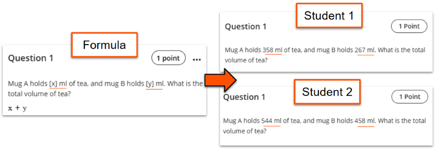

### Anonymity

!!! Warning 

    Anonymously marked Tests are much harder to administer, so avoid anonymity and manually marked Essay question types unless absolutely necessary.

For any Test that contains only auto-marked questions, there is no need for anonymity. Anonymity is only required for summative exams with manually marked Essay question types; we don't recommend anonymity for formative exams.

If anonymous marking is on for the Test, you:

- can't see who has submitted/started. This makes it hard to manage exam access, especially for large cohorts.
- can't download answers, overall results or question scores until results are de-anonymised.

--- 

## Create a Test

!!! Tip

    Consider the appropriate location for the Test; with weekly content (specific content) or in the Assessment section (general content or formal assessment). 

To create a Test:

1. Hover where the Test should appear. Click the plus icon, then **Create**, then select **Test**.
2. Enter a descriptive **name** at the top left. 
3. Click the plus icon to add **questions** (see Test questions section below).
4. Set a **Due date** within work hours and adjust other settings as needed (see Test settings section below).
5. Once confident that the Test is ready, set it as **Visible to students** or specify  **Release conditions** in the top right (see our guide to [Content visibility](../ultra/content-visibility.md) for more detail).

You can build and trial the Test in your personal Ultra sandpit site, and when it is ready use the [Copy Content tool](../ultra/copy-content.md) to add it to your module/exam site in the relevant location.

--- 

## Questions

!!! Tip

    Don't use Essay type questions for practice quizzes or other Tests that need automatic mark return. Essay questions must be manually marked before scores are visible for any question in the Test.

### Question types

Key question types are summarised below. See [Blackboard's Question Types guide](https://help.blackboard.com/Learn/Instructor/Ultra/Tests_Pools_Surveys/Question_Types) for details of the various other question types available. 

| Question type | Description | Grading type | AI generation |
| ----------- | ----------- | ----------- | ----------- |
| [Multiple Choice](https://help.blackboard.com/Learn/Instructor/Ultra/Tests_Pools_Surveys/Question_Types/Multiple_Choice_Questions)  | Pick a single correct answer from options given. | auto graded | can be auto-generated |
| [Multiple Answer](https://help.blackboard.com/Learn/Instructor/Ultra/Tests_Pools_Surveys/Question_Types/Multiple_Answer_Questions)  | Pick multiple correct answers from options given. Can give partial or negative credit. | auto graded | manual only |
| [Fill in the Blank](https://help.blackboard.com/Learn/Instructor/Ultra/Tests_Pools_Surveys/Question_Types/Fill_in_the_Blank_Questions) | Input the missing word(s) in the given text. Answer can be exact or match a pattern | auto graded | can be auto-generated |
| [Matching](https://help.blackboard.com/Learn/Instructor/Ultra/Tests_Pools_Surveys/Question_Types/Matching_Questions)| Match corresponding items from two groups. Can give partial or negative credit. | auto graded | can be auto-generated |
| [Calculated Formula](https://help.blackboard.com/Learn/Instructor/Ultra/Tests_Pools_Surveys/Question_Types/Calculated_Formula_Questions)  | Calculate the answer to a given formula (eg. 3x + 4y = ?). Values (x/y) are randomly generated so each student has a different question.| auto graded | manual only |
| [Calculated Numeric](https://help.blackboard.com/Learn/Instructor/Ultra/Tests_Pools_Surveys/Question_Types/Calculated_Numeric_Questions)  | Similar to Fill in the Blank questions, but for numeric answers. Answer can be exact number or within a range.| auto graded | manual only |
| [Essay](https://help.blackboard.com/Learn/Instructor/Ultra/Tests_Pools_Surveys/Question_Types/Hotspot_Questions)  | Enter a text response (of any length). Can provide a model answer for help grading. | **manually graded** | can be auto-generated |

### Add questions

!!! Tip

    If a question has any supporting items (eg. figure, table, dataset), use the text editor to add these within the question text rather than as standalone items. This will ensure the item is always displayed with the question. 

There are multiple ways to add questions to a Test. Which method is most appropriate depends on the amount of questions to add, whether to display all questions or a random subset, and whether questions have already been added elsewhere in the site.
 
??? Abstract "Manually add questions"

    Add questions individually within the Test interface. You may find it helpful to draft your questions in another document first.

    1. Click the **plus + icon**.
    2. Select the relevant question type.
      
    3. Enter the question and answers as needed for that question type.
    4. Optional question settings (availability depends on question type):
        - set partial or negative credit for different answers
        - set the question as extra credit
        - add automated feedback (auto-marked types) or example correct answer (Essay type only)
        - change the points awarded (default = 1 point)
         
    5. Click **Save**.
    6. Repeat for all questions.

??? Abstract "Auto-generate questions with AI"

    Use the [AI Design Assistant Tool](../ultra/ai-da.md) to auto-generate key question types based on your site content. See [Question types](#question-types) above for the supported types.

    !!! ai "Using AI tools effectively"

        AI-generated content is a **starting point** for your own content development rather than a finished product. You must always **carefully check** output for accuracy and appropriacy and adapt as needed.

        See our [general guide to Artificial Intelligence tools](../other-tools/ai.md) for more details on using AI responsibly.

    1. Create a Test or open an existing Test or Question Bank. To generate a new Question Bank, select **Auto generate** and skip step 2.
    2. Click the **plus icon** where you would like the question(s) to appear, and select **Auto-generate question**.
      
    3. Define the questions:
        - Enter a **Description** and/or **Select course items** to help generate more relevant questions.
        - Select the **Question type** to generate. *Inspire me!* will generate a mix of question types.
        - Set the **Complexity** level and choose how many questions to create.
    4. Click **Generate**.
    5. Review the questions. Select which question(s) to include, or repeat steps 3 and 4 to generate new questions.
    6. Click **Add to Assessment**.
    7. Carefully check the questions for accuracy and appropriacy and edit as needed. 

    If course items are selected to provide context, questions may be based on procedural instructions within an item. If this occurs, you may find it more effective to instead provide a detailed description of the desired content.

    

    ??? Abstract "Test questions: interface and examples of generated content"

        **Description:** focus on navigation techniques and appropriate ways to use them

        **Select course items**: none selected

        **Question type**: Multiple choice

        **Complexity:** level 7/10

        **Number of question**: 4 (maximum 10)

        **Content generated:**

        *Question 1.* Which of the following is an advisable way to navigate safely in poor visibility?

        - A. Pacing and timing to estimate distance travelled [Correct answer]
        - B. Relying solely on GPS for directions
        - C. Running at full speed to get through the fog quickly
        - D. Following random sheep tracks

        Further questions are not visible on this screen, scroll to reveal.

??? Abstract "Upload questions from a file"

    Draft questions in a spreadsheet and **upload them in .tsv format** to your Test. This is helpful to import lots of questions quickly.

    To use optional question settings (eg. partial credit), first upload your file and then manually update each question.

    **Prepare the file**

    1. Make a copy of the [Ultra tsv template for Tests Google Sheet](https://docs.google.com/spreadsheets/d/17G_QC4bgFbiLmgIFyIl-jOfLbLLFr8yAxCMF3flwGoM/copy)
    2. Enter your questions by editing the *BB test* tab (contains examples of the formatting required for each question type).
     
    3. Download the questions in .tsv format: File > Download > Tab-separated values (.tsv)

    **Upload the file**

    1. Return to the Test and click the **plus + icon**.
    2. Select **Upload questions from file**.
     
    3. Select your .tsv file.
    4. Once the upload is processed, review the status message for any errors.

    For more details and examples of the required file format, see [Blackboard's guide to uploading questions](https://help.blackboard.com/Learn/Instructor/Ultra/Tests_Pools_Surveys/Reuse_Questions/Upload_Questions).

??? Abstract "Reuse questions"

    Add questions that already appear in another Test or Question Bank in the site. This **copies questions**, so any edits made to re-used questions are not updated in the original question. 

    1. Click the **plus + icon**.
    2. Select **Reuse questions**.
     
    3. Select the questions to copy, using the filter options if needed: search by keyword, browse by source (Tests and Question Banks), browse by question type.
    4. Click **Copy questions**.
    5. Once the copy is processed, review the status message for any errors.

??? Abstract "Question pools (to draw a random subset of questions)"
 
    Build a [question pool to randomly draw a subset from in each Test attempt](#randomisation). Choose from questions that already appear in another Test or Question Bank in the site.
    
    Question pools **do not copy questions**; any edits made to questions in a pool will appear everywhere that question is used. Deleting a question from a Question pool does not delete the question in other locations.

    1. Click the **plus + icon**.
    2. Select **Add question pool**.
     
    3. Select the questions to add, using the filter options if needed: search by keyword, browse by source (Tests and Question Banks), browse by question type.
    4. Click **Add questions**.
    5. Enter the number of questions to display and optionally update the points awarded per question. Click **Save**.
     
    6. In edit mode a summary of the pool is shown where you can view the questions and edit settings. Students will see the questions pulled from the pool.
     

    For more details, see the [BlackBoard Help guide to Question pools](https://help.blackboard.com/Learn/Instructor/Ultra/Tests_Pools_Surveys/ULTRA_Reuse_Questions/Question_Pools).

    

    

    <iframe width="560" height="315" src="https://www.youtube.com/embed/6otJ5eCXf_E?si=LwxK1f6Qi858lotq" title="YouTube video player" frameborder="0" allow="accelerometer; autoplay; clipboard-write; encrypted-media; gyroscope; picture-in-picture; web-share" referrerpolicy="strict-origin-when-cross-origin" allowfullscreen></iframe>
     [Use Question Pools in Assessments in the Ultra Course View [YouTube]](https://youtu.be/cuWBxlV2FVM?si=ulkRHUN9G8-YGIWq)
    

    

### Download question paper

You can print or download your Test as a PDF, along with an automatically-generated answer key. This could be useful for archiving and sharing with external examiners, reviewers etc.

!!! Tip
    
    If randomisation is used, a new version is generated each time the Test is printed.

To print or save a Test:

1. Open the **Content and Settings** tab in the relevant Test. 
2. Click **Print** above the Test content.
3. Click **Print** in the pop up box.
4. The answer key (shown first) and test are generated and shown in print preview. Save as PDF or send to the printer.

---

## Settings

!!! Warning

    Very specific settings are required for **formal exams** using Test. You **must** [contact us](mailto:vle-support@york.ac.uk) well in advance to set up these up correctly. This guide should not be considered sufficient guidance for this use case.

Open the full assessment settings by clicking the **cog icon** at the top of the **Assessment settings** panel next to test content. This panel also includes key quick-access settings.

### Details & Information (Due date)

!!! Question "Key consideration: Does your Test need a due date?"

    Setting a due date is only recommended for low-stakes summative quizzes with a specific deadline. If required, enter a due date and time during core work hours and [apply SSP extensions](#ssp-accommodations). **Students must be able to start and submit late attempts.**
    
These settings **can** be updated after students have started their submissions.

- *Due date*: tick *No due date* or enter a deadline and [apply SSP extensions](#ssp-accommodations).
- **! Do not tick !** *Prohibit late submissions*: in-progress attempts are automatically submitted at the deadline (not marked late). Can't start new attempts after the deadline.
- **! Do not tick !** *Prohibit new attempts after due date*: in-progress attempts at the deadline can be manually submitted after the deadline (marked late). Can't start new attempts after the deadline.
- *Allow class conversations*: attaches a Discussion to the Test. Recommend to leave unticked.

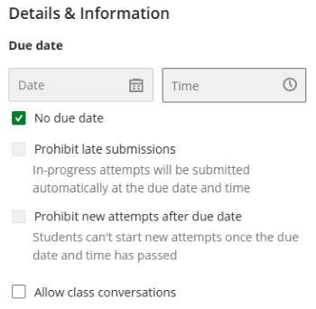

### Presentation Options

!!! Question "Key consideration: randomisation for robust assessment"

    Randomising test content for each attempt can support robust assessment by reducing opportunity for collusion, especially for remote uses of Test. To use random order, make sure that questions/answers do not need to appear in a specific order.

Presentation options mostly relate to the order that questions appear in for each attempt. See the [randomisation section](#randomisation) for more details.

These settings **cannot** be updated after students have started their submissions.

- *Display one question at a time*: shows each question as a separate page. May be useful for longer Tests or with maths-heavy content.
- **! Do not tick !** *Prohibit backtracking*: stops students going back to previous questions.
- *Randomise questions*: shows all questions in a random order. With pagination, randomises questions within pages.
- *Randomise answers*: shows MCQ options in a random order.
- *Randomise pages*: if pagination is used, shows pages in a random order. The first page can be excluded (eg. instructions page).

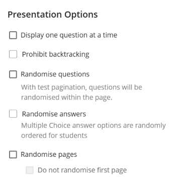

### Formative Tools

!!! Question "Key consideration: is the Test formative?"

    We recommend applying both of these settings for any formative or practice use of Test.

These settings **can** be updated after students have started their submissions.

- *Formative Assessment*: shows a formative label on the Test. This doesn't exclude the item from any automatic Gradebook mark calculations.
- *Display formative label to students*: default on if *Formative assessment* is ticked. Leave ticked.

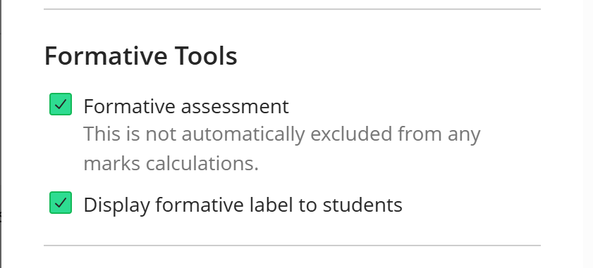

### Marking & Submissions

!!! Question "Key consideration: does marking need to be anonymous?"

    [Anonymity](#anonymity) should only be applied if absolutely required for a summative Test containing manually marked questions.

!!! Question "Key consideration: should marks be posted (released) automatically?"

    - To automatically release marks immediately after submission, **use only auto-marked question types** and tick *Assessment mark: post automatically*.
    - To release all marks together, untick *Assessment mark: post automatically* and manually post marks when ready.
    - Essay-type questions **must be marked manually** before any marks can be released.

Unless otherwise stated, these settings **can** be updated after students have started their submissions.

- *Mark Category*: may change the icon shown on the item, but doesn't have any real impact.
- *Attempts allowed*: how many test submissions can be made. For formative use, set to *Unlimited*. For summative low-stakes quizzes set to the relevant amount.
- *Attempts to mark*: which test submission to mark. In most cases leave as *Last attempt*. For the highest or average score of multiple attempts, select *All attempts* then the relevant *Final mark calculation* (average, highest, lowest mark).
- *Mark using*: leave as the default *Points*, change to *Percentage* or use a [mark schema](../ultra/mark-schema.md) to convert marks to qualitative categories.
- *Maximum points*: automatically calculated from individual question scores, cannot be edited.

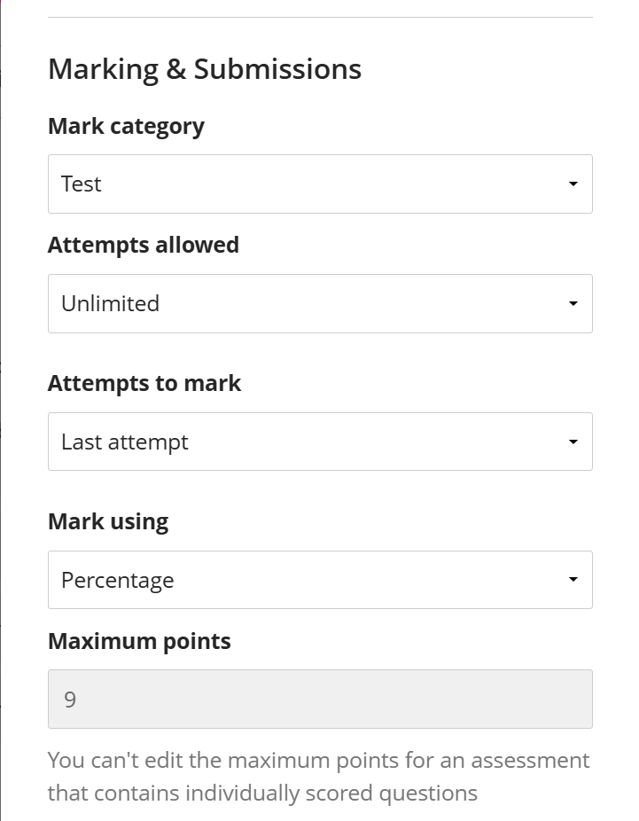

- *Anonymous marking: Hide student names*: only use if absolutely required for summative Tests with manually marked questions. Can't be used with automatic mark posting. Can't be updated after students have started their submissions.
- *Evaluation options: Delegated marking*: assign markers to specific groups of students. Only required for manually marked questions and large cohorts.
- *Assessment mark: post automatically*: immediately releases overall mark after an attempt is submitted (if all auto-marked questions) or marked (if includes essay questions). Untick to manually manage overall mark release. See [Assessment results](#assessment-results) to manage access to Test content after marks are released.

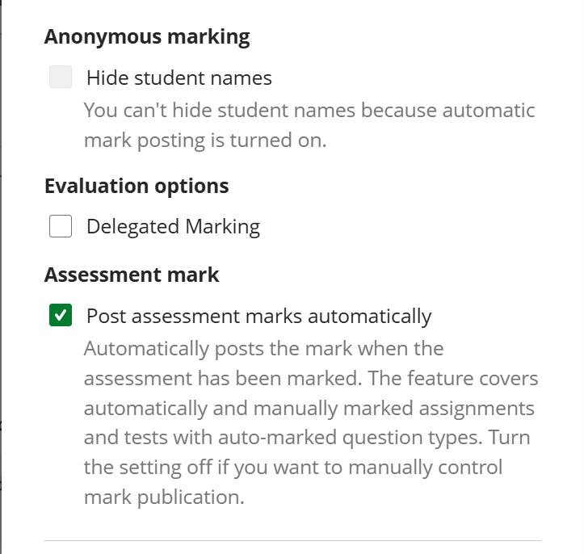

### Assessment results

!!! Question "Key consideration: what results and feedback should be given?"

    What results information should be shown to students varies greatly across uses of Test; a practice quiz may immediately show all question scores and correct answers after submission, whereas a formal exam may restrict results feedback to viewing their submission only on a set date.

!!! Warning 

    Essay-type questions must be manually marked before students can view any results or feedback, regardless of when they are set to be released. **Don't use Essay questions if the Test won't be manually marked** and you want to automatically release results and feedback.

These settings **can** be updated after students have started their submissions. See the [Student view: Results section](#student-view-results) below for more details of how the various results options appear to students.

What students can view, in addition to the posted overall mark:

- *Submission view*: the questions and their own submitted responses. Required to view any of the below options.
- *Automated question feedback*: any correct or incorrect answer feedback added for auto-marked questions. The correct answer isn't specified, but may be stated or implied in the feedback text added.
- *Question scores*: scores for individual questions. The correct answer is not specified, but it may be possible to deduce this. Required to view correct answers. Can't be edited if anonymous marking is on.
- *Correct answers*: correct answers for auto-marked questions and any example correct response added for essay questions. It is not possible to show only one of these feedback components. Can't be edited if anonymous marking is on.

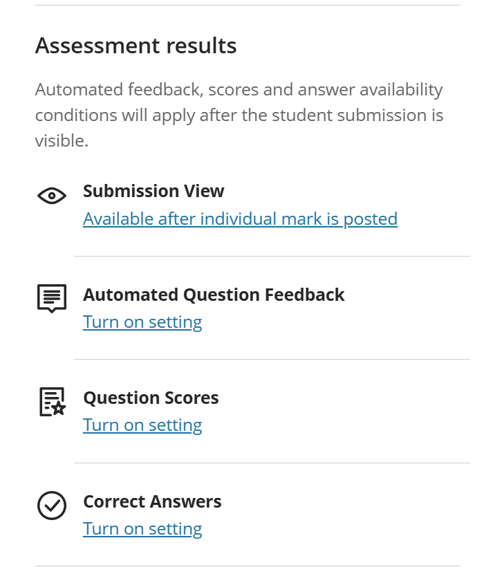

Results can be released at various times:

- *After submission*: releases immediately after submission. Applies to *submission* and *automated feedback* only.
- *After individual mark has been posted*: releases after [automatic or manual mark posting](#assessment-results). Does not apply for *automated feedback*. 
- *After due date*: releases after the deadline passes, if set.
- **! Do not tick !** *After all marks have been posted*: won't release until all students with access to the Test have received an overall mark, which often does not occur. 
- *On specific date*: releases chosen results components at a specific date and time. Often used to release formal exam results.
- **! Do not tick !** *One time*: allows a single view after submission. If this restriction is needed, instead manage site and Test availability to allow access for a specific period.

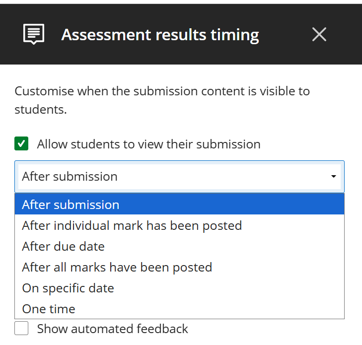

### Assessment security

!!! Question "Key consideration: is fine access control needed?"

    If it's not known exactly who will need access to your Test and when, access can be managed by setting up an access code to open the Test. This may be useful for escape room-type activities or to manage starts across multiple rooms for in-person exams with Test.

This setting **can** be edited after students start their submissions.

- *Access code*: click *Add access code* and toggle on the slider to require students to enter a 6-digit code to begin an attempt.

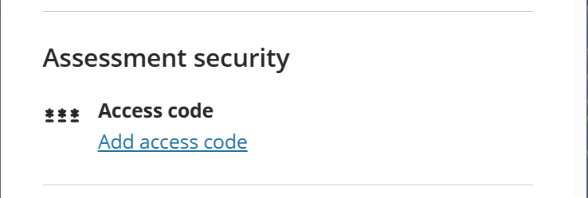

### Additional tools & Description

Unless stated, these settings **cannot** be updated after students have started their submissions.

- *Time limit*: adds a timer for attempts, with optional automatic submission at the end. Used for formal exams, but otherwise **do not use without a clear pedagogical need**. Must apply [SSP extensions](#ssp-accommodations) for relevant students; don't make multiple Tests with different time limits.
- *Assign to groups*: use as a collaborative group task. May be useful for escape room-type activities, but otherwise not likely to be useful for other uses of Test.
- *Originality report*: adds Turnitin originality reporting. This should not be required; if you think this is needed, it's likely a different tool will be more suitable than Test.
- *Description*: adds a contextual note to the Test item on the Course Content page. Maximum 750 characters. Can be updated after students have started their submissions.

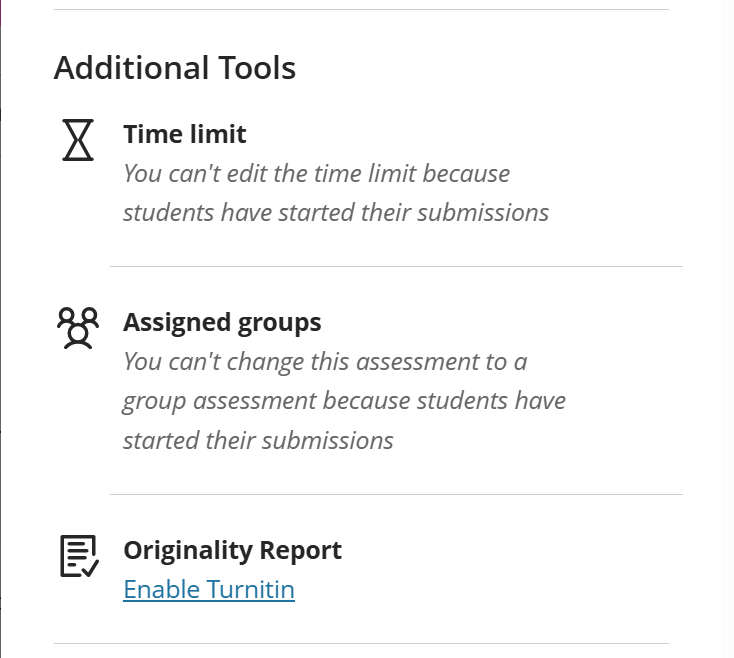

### SSP accommodations

SSP deadline extensions or extra time allowances must be applied for summative Tests and for formal formative tests.

See our [Accommodations for SSPs guide](../ultra/accommodations.md) for instructions on how to do this.

<figure markdown>
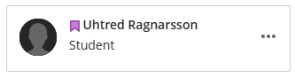
<figcaption>Flag denoting time limit accommodation</figcaption>
</figure>

--- 

## Marking & results

### Review auto-marked scores

For fully auto-marked Tests, no manual marking is required. You can review the marks in the *Test's Submissions* tab or in the *Gradebook Marks* tab. See the [guide to view Gradebook data](../ultra/gradebook.md#view-gradebook-data-and-submissions) for more details.

### Manual marking

!!! Tip

    Make sure that the Test is Hidden from students to prevent accidentally releasing marks early.

If a Test contains Essay type questions, these must be manually marked. This **must occur before scores or feedback for auto-marked questions can be released**, so Essay questions should be avoided in most cases.

1. To open a Test submission, click the *Submissions* tab within the Test and select an attempt from the list. For other methods to access submissions, see our [guide to open Ultra Assignment submissions](../ultra/assignment-marking.md#1-open-a-submission).
 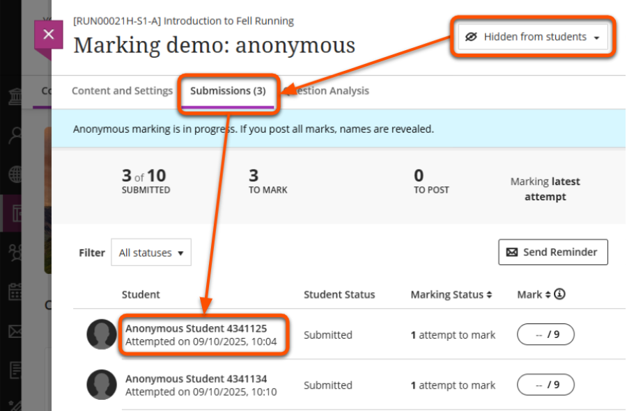
2. If a Due Date was set, the correct attempt to mark may not be the default attempt presented for marking. You will need to check which attempt to mark if there are late submissions. See our [Assignment marking guide](../ultra/assignment-marking.md#2-late-submissions-check-for-previous-submissions) for details.
3. Marking methods:
    - **Anonymous: mark by student**. If anonymous marking is on, Essay type questions must be marked within the full attempt. If randomisation was used, question order will differ between attempts.
     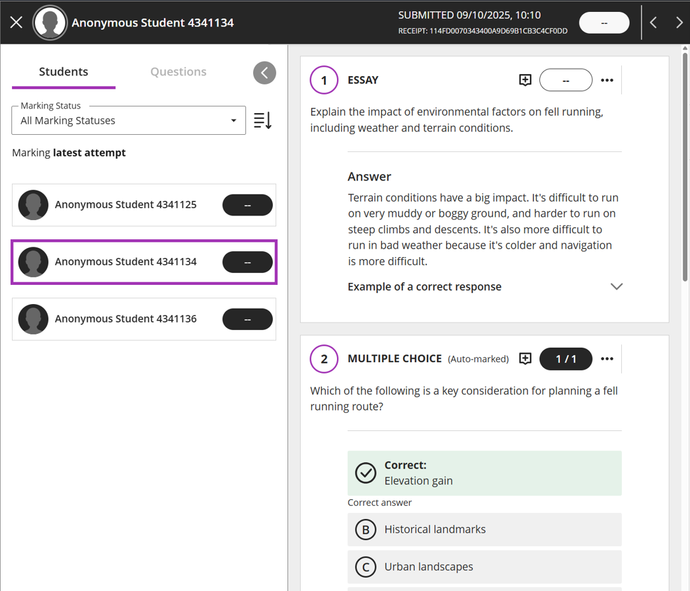
    - **Non-anonymous: mark by question**. Click the **Questions** tab above the student list to group all the responses for each question. The question text is shown above the responses.
     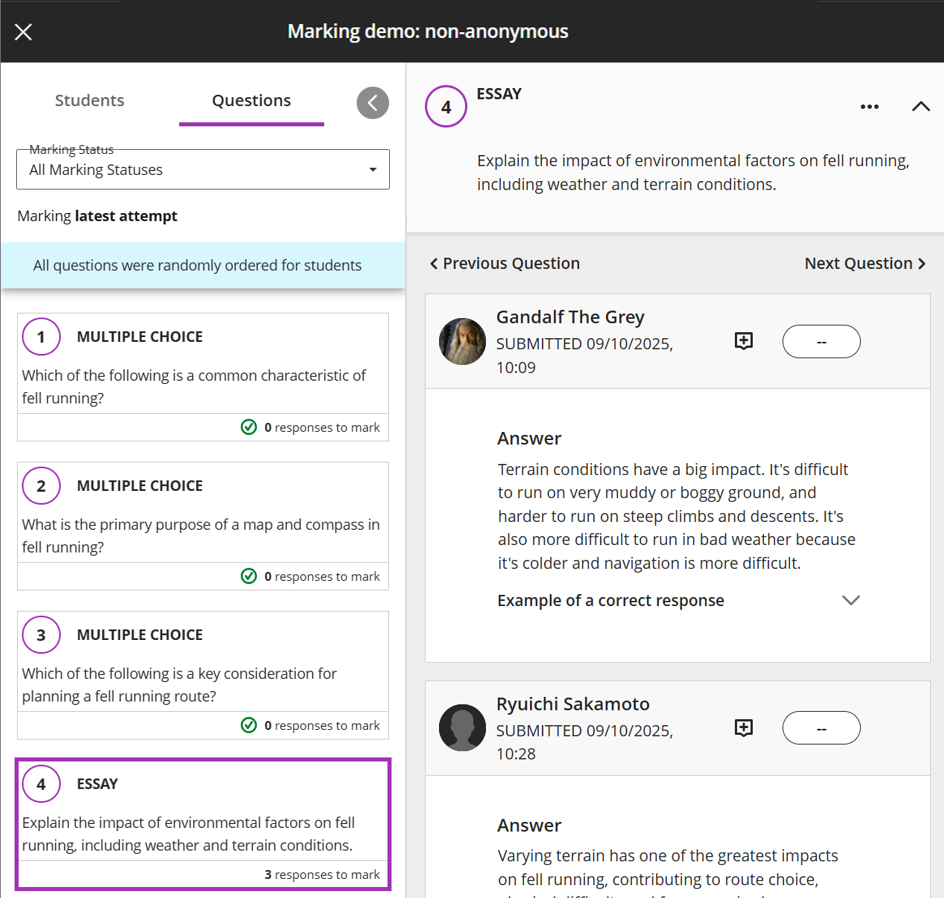
4. Review each essay question response. If an *example correct response* has been provided, click the chevron icon in the bottom right to show/hide it. Enter a score in the *mark pill* in the top right.
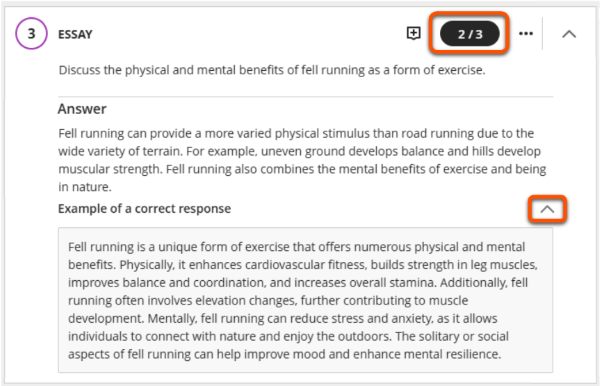
5. Once each essay question in an attempt has been marked, the final score is updated in the overall mark pill (on Student view).
 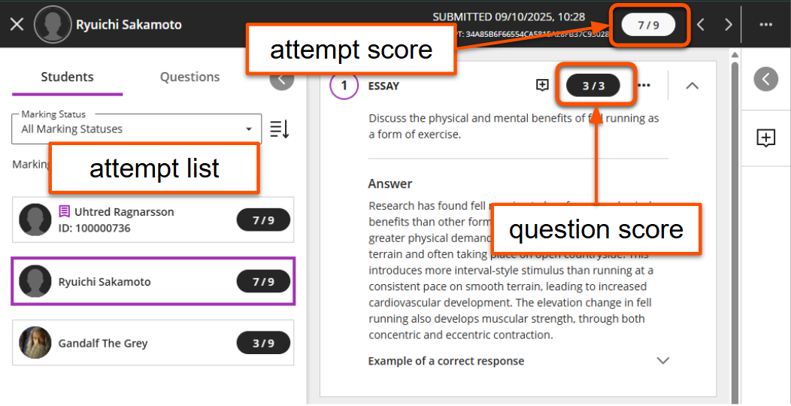
6. When marking is complete, click *Post all marks* on the Test submissions tab (if anonymously marked, this will also **de-anonymise results**).
7. When ready to release marks, make the Test (and site, if needed) visible to students.

### Student view: results

After marks are released, students can view various aspects of assessment results and feedback via the original Test interface. These are summarised here, see the [Assessment results settings section](#assessment-results) for details.

| View option | What this shows | Earliest availability |
| ---------- | ---------- | ---------- |
| Submission view | Questions and responses, plus overall mark (if posted) | After submission |
| Automated question feedback | Feedback added for correct/incorrect answers (auto-marked questions) | After submission |
| Question scores | Individual question scores | After marks posted |
| Correct answers | Correct answers (auto-marked questions) and any example correct responses added (essay questions) | After marks posted |

??? Abstract "What students see: MCQs"

    

    

    <figure markdown>
    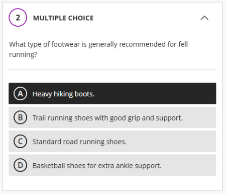
    <figcaption>MCQ: submission</figcaption>
    

    

    <figure markdown>
    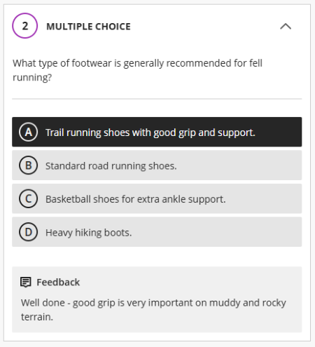
    <figcaption>MCQ: automated feedback</figcaption>
    </figure>
    

    

    <figure markdown>
    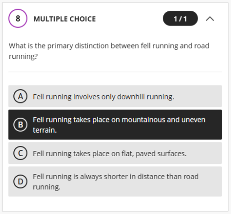
    <figcaption>MCQ: question score</figcaption>
    </figure>
    

    

    <figure markdown>
    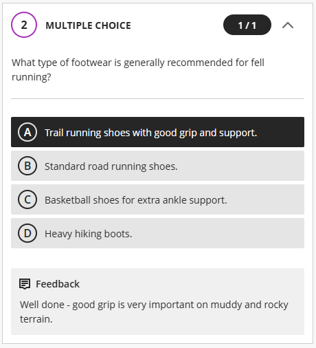
    <figcaption>MCQ: automated feedback & question score</figcaption>
    </figure>
    

    

    <figure markdown>
    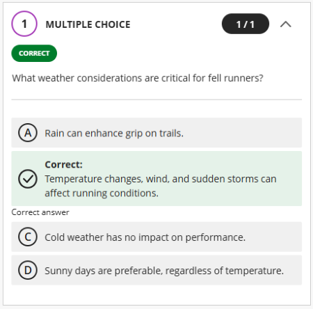
    <figcaption>MCQ: correct answers - correct question</figcaption>
    </figure>
    

    

    <figure markdown>
    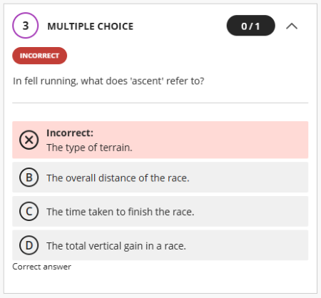
    <figcaption>MCQ: correct answers - incorrect question</figcaption>
    </figure>
    

    

??? Abstract "What students see: Essay questions"

    

    

    <figure markdown>
    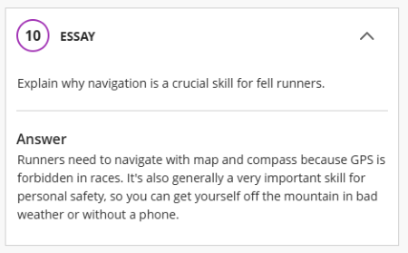
    <figcaption>Essay: submission</figcaption>
    </figure>
    

    

    <figure markdown>
    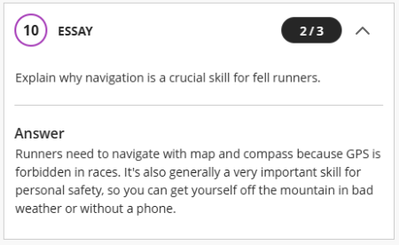
    <figcaption>Essay: question score</figcaption>
    </figure>
    

    

    <figure markdown>
    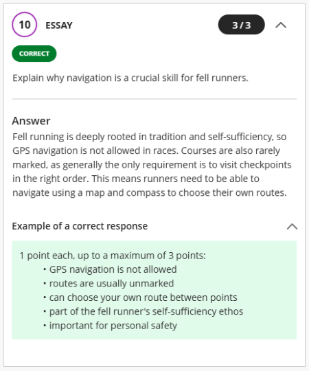
    <figcaption>Essay: correct answers - correct question</figcaption>
    </figure>
    

    

    <figure markdown>
    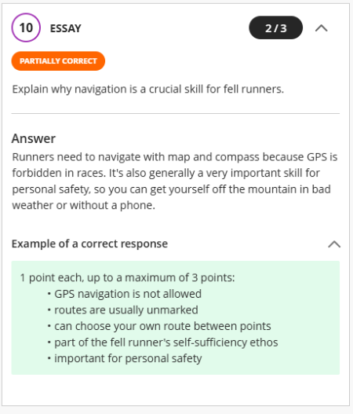
    <figcaption>Essay: correct answers - partially correct question</figcaption>
    </figure>
    

    

### Download results and question scores

!!! Tip

    An anonymously marked Test must be de-anonymised (by posting all marks) before results can be downloaded.

After marking is complete, you can also download overall results or by-question scores. See our [guide to downloading Gradebook data](../ultra/gradebook.md#download-gradebook-data) for details.

### Question Analysis

The Question Analysis tool gives analytics data on:

- General Test summary: average overall score, number of possible questions, number of completed attempts, average time spent
- Individual questions:
    - discrimination: measure of how well the question differentiates between high and low-scoring students
    - difficulty: percentage of students who answered correctly
    - breakdown of answers selected (auto-marked question types)

<figure markdown>
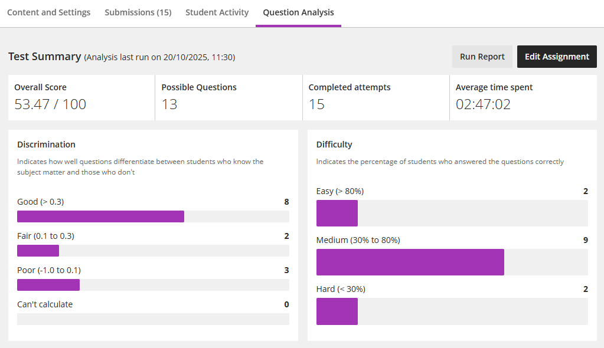
<figcaption>Question Analysis: Test Summary information</figcaption>
</figure>

This can be useful to understand student performance and review and refine your question practice for future tests. For example, if one question is consistently answered incorrectly, you can review the question wording and answers chosen to see if the question is genuinely difficult, or if there is as issue with the question wording that could be tweaked for next time. 

See [Blackboard Help's guide to Question Analysis](https://help.blackboard.com/Learn/Instructor/Ultra/Tests_Pools_Surveys/Ultra_Question_Analysis) for more details.