---
tags:
    - Assessment
    - Interactive content
    - Ultra
---

# Test

!!! Summary

    Test is a quiz and exam tool with a wide range of uses from informal knowledge checks to summative exams.

    This guide covers how to use and set up a Test, and is primarily aimed at **teaching staff**.

!!! principle "Relevant [VLE site design principles](../ultra/site-design-principles.md)"

    - 3.4 Essential: Site and materials content is accessible.
    - 4.1 Essential: The assessment section contains all information about module assessments.
    - 4.2 Essential: Assessment instructions are clearly labelled and explain the task and requirements.

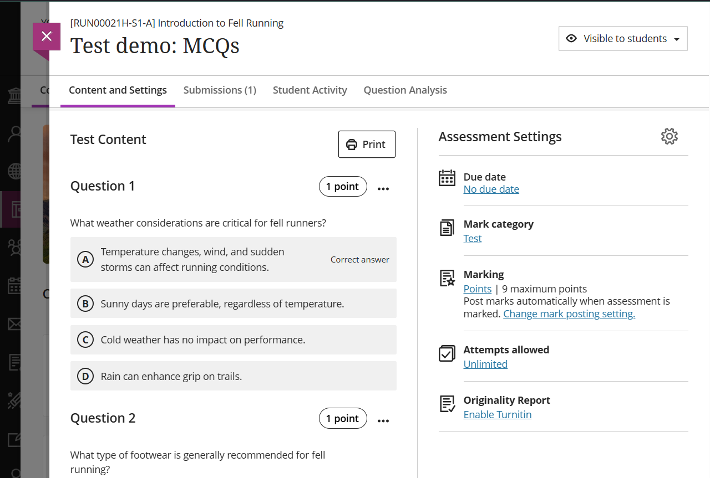

## When to use Test

Test has a lot of flexible features, which makes it useful in many situations, from short practice quizzes to formal summative exams:

- **Wide range of question types**: most with automatic marking and feedback
- **Multiple ways to add questions**: manually create questions, import questions from file or reuse questions from existing banks or tests
- **Randomisation**: randomise the order of questions and/or answer options presented in each Test, or use calculated formula/numeric questions to automatically generate a large bank of different questions
- **Question banks and pools**: present a random selection of questions for each student
- **Flexible grading possibilities**: can set up partial, negative and extra credit

=== "Knowledge check"

    **A short, one-off self-assessment.**

    Some examples:

    - **self assessment/knowledge check**: a few questions to check understanding of weekly content. You can do this using Test or by adding questions directly within a [Document](../ultra/documents.md).
    - **track completion** of required content (eg. safety materials): honesty-based True/false question to self-declare completion.
    - **demonstrate preparation** for workshops or practicals: a few questions on preparatory content or True/False to self-declare completion.

    Test completion can also be used as a criteria for setting [Release Conditions](../ultra/content-visibility.md) for other items. For example, access to laboratory session materials could be restricted until students have successfully completed a preparatory quiz.

    Common features:

    - Tend to be short: usually 5 or fewer questions
    - Question display: usually all possible questions
    - Question types: all **questions should be automatically marked** so no input is needed from teaching staff
    - Set up effort: low, usually quick and simple to set up
    - Insights to inform teaching: easy to gauge engagement and identify learning gaps

=== "Practice quiz"

    **An informal quiz that can be taken multiple times.**

    Some examples:

    - **practice quizzes**: providing an active opportunity to practice 'right answer' content (eg. match terminology, complete calculations)
    - **revision quizzes** covering part of or all module content

    Common features:

    - Question display: to allow students to retake the quiz, it's common for practice quizzes to use question pools to display a random subset of questions drawn from a larger question bank. However, it is also possible to display a fixed set of questions each time.
    - Question types: all **questions should be automatically marked** so no input is needed from teaching staff
    - Set up effort: low to medium, depending on how questions are created and whether random subsets are used.
    - Insights to inform teaching: easy to gauge engagement and identify learning gaps, question analysis can help you monitor the efficacy of your question design

=== "Formal exam"

    **Formal summative or formative exams**

    Some examples:

    - **Remote exam**: students begin the exam during a given time window (eg. 10:00 - 10:30) at a place of their choosing. They then have the given time limit (or longer if accommodations are set) to complete the exam. Can't be invigilated.
    - **Scheduled on-campus exam**: students complete the exam at a set time in an on-campus computer lab. Can be invigilated, but computer access to other tools can't be locked down. We will advise on set up, but the department must take full responsibility for delivering these exams. For example, it's not possible for central technical support staff to attend in the room.
    - **Formative/mock exam**: to familiarise students with the online exam process.
    
    Common features:
    
    - Question display: to support robust assessment, formal exams generally use question pools to display a random subset of questions drawn from a larger question bank.
    - Question types: preferably automatically marked (to allow **non-anonymous** workflows, which are significantly easier to administer), but can include manually marked questions.
    - Set up effort: medium to high, as requires very careful set up and checking.

    !!! Warning

        If you are setting up a summative Test, also review this more detailed guide:   
        [Staff Help: Considerations Around & Setting up a **Summative** VLE Test](https://docs.google.com/document/d/1sn85oHTEuxNuw3_6R_TqdGlgrlWAgyCEtv7FXyd0his/edit?usp=sharing)
        
        You **must** [contact the Digital Education Team](mailto:vle-support@york.ac.uk) well in advance if you want to run a summative and/or synchronous exam (in person or online) using Ultra Test.

Find out more about how Test has been applied across the University:

??? case-study "Case study: Ultra Test for formative and summative assessment [Computer Science]"

    Tommy Yuan shares his experiences of using the Ultra test tool for formative and summative assessment. Topics include how it can save time for lecturers and administrators, and reduce the likelihood of collusion and academic misconduct.

    Watch their presentation:<iframe src="https://york.cloud.panopto.eu/Panopto/Pages/Embed.aspx?id=0ed26b92-2446-45e4-9815-b141010d308f&autoplay=false&offerviewer=true&showtitle=false&showbrand=false&captions=false&interactivity=all" height="405" width="720" style="border: 1px solid #464646;" allowfullscreen allow="autoplay" aria-label="Panopto Embedded Video Player" aria-description="Tommy Yuan: VLE Test for assessment" ></iframe>

    [VLE Test for assessment (Panopto viewer)](https://york.cloud.panopto.eu/Panopto/Pages/Viewer.aspx?id=0ed26b92-2446-45e4-9815-b141010d308f) (6 mins 59 secs, UoY log-in required)

    See the [full case study for more details and the transcript](../training/case-studies/cs-yuan.md).
    You can also browse our [full set of case studies](../training/case-studies/index.md).

??? case-study "Case study: Ultra Test for practice quizzes [Language & Linguistic Science]"

    Ellie Rye provides a walkthrough of the 'Structure of English' Ultra site, describing how they applied the Ultra template to present teaching content, and reflects on the use of Discussions and Tests for formative practice quizzes.

    Watch their presentation:<iframe src="https://york.cloud.panopto.eu/Panopto/Pages/Embed.aspx?id=affd8a23-7d50-4d21-87d0-b15600b04234&autoplay=false&offerviewer=true&showtitle=false&showbrand=false&captions=false&interactivity=all" height="405" width="720" style="border: 1px solid #464646;" allowfullscreen allow="autoplay" aria-label="Panopto Embedded Video Player" aria-description="Ellie Rye, LLS, Structure of English" ></iframe>

    [Structure of English (Panopto viewer)](https://york.cloud.panopto.eu/Panopto/Pages/Viewer.aspx?id=affd8a23-7d50-4d21-87d0-b15600b04234) (8 mins 21 secs, UoY log-in required)

    See the [full case study for more details and the transcript](../training/case-studies/lls-rye.md).
    You can also browse our [full set of case studies](../training/case-studies/index.md).

### Question types

| Question type | Description | Grading type | AI generation |
| ----------- | ----------- | ----------- | ----------- |
| [Multiple Choice](https://help.blackboard.com/Learn/Instructor/Ultra/Tests_Pools_Surveys/Question_Types/Multiple_Choice_Questions)  | Pick the correct answer(s) from options given. Option order is randomised. Can give partial or negative credit. | auto graded | can be auto-generated |
| [Fill in the Blank](https://help.blackboard.com/Learn/Instructor/Ultra/Tests_Pools_Surveys/Question_Types/Fill_in_the_Blank_Questions) | Input the missing word(s) in the given text. Set if answers should be exact, match part of a specified answer or match a pattern. | auto graded | can be auto-generated |
| [Matching](https://help.blackboard.com/Learn/Instructor/Ultra/Tests_Pools_Surveys/Question_Types/Matching_Questions)| Match corresponding items from two groups. Options can be fixed or randomised. Can give partial or negative credit. | auto graded | can be auto-generated |
| [True/False](https://help.blackboard.com/Learn/Instructor/Ultra/Tests_Pools_Surveys/Question_Types/Matching_Questions)| Choose True or False in response to a given statement. | auto graded | can be auto-generated |
| [Calculated Formula](https://help.blackboard.com/Learn/Instructor/Ultra/Tests_Pools_Surveys/Question_Types/Calculated_Formula_Questions)  | Calculate the answer to a given formula (eg. 3x + 4y = ?). Values (x/y) are randomly generated so each student has a different question.| auto graded | manual only |
| [Calculated Numeric](https://help.blackboard.com/Learn/Instructor/Ultra/Tests_Pools_Surveys/Question_Types/Calculated_Numeric_Questions)  | Similar to Fill in the Blank questions, but for numeric answers. Can set the answer as an extact number or within a range.| auto graded | manual only |
| [Hotspot](https://help.blackboard.com/Learn/Instructor/Ultra/Tests_Pools_Surveys/Question_Types/Hotspot_Questions)  | Drop pin(s) on an image. Consider accessibility carefully. | auto graded | manual only |
| [Essay](https://help.blackboard.com/Learn/Instructor/Ultra/Tests_Pools_Surveys/Question_Types/Hotspot_Questions)  | Type a response (of any length) in the answer box. Can provide a model answer for feedback. | manually graded | can be auto-generated |

## Accessible Test Content

As with all teaching content, accessibility is very important when building test questions and answer options. [All the usual considerations around accessibility apply to tests](../accessibility/accessible-ultra-content.md), but it is **particularly** important that you take into consideration accessiblility when using tables, images or mathematical content in test questions.

- Guidance on creating accessible images, table and maths can be found on [our "Ultra Accessibility" VLE page](https://vle.york.ac.uk/ultra/courses/_106795_1/outline). (Don't have access? [Contact us](mailto:vle-support@york.ac.uk)).
- [Examples of quality alternative text on graphs, diagrams and other complex images can be found here](https://www.routledge.com/our-customers/authors/publishing-guidelines/accessible-content/general-samples).

## Create a Test

=== "Knowledge check"

    **Location**

    Knowledge checks are best located alongside the relevant materials, usually within a weekly content section.

    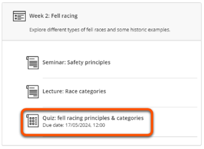

=== "Practice quiz"

    **Location**

    Locate the quiz where it will make most sense to students. This could be:

    - practising specific content: alongside weekly materials.
    - general revision: in the Assessment section (make sure to label clearly as a formative practice quiz to avoid confusion with formal assessment items)

    You can use a [Course Link](../ultra/course-links.md) to show a quiz in more than one location.

=== "Formal exam"

    **Location**

    Consider the location of the exam and also information about how to take the exam.

    - Exam itself: usually created in a separate exam site to aid set up and for exam security.
    - Details of the exam: include in the Assessment section of your module site.

1. Hover where you want the Test to appear, click the plus icon, then **Create**, then select **Test**.
2. Enter a descriptive **name** at the top left. 
3. Click the plus icon to add **questions** (see Test questions section below).
4. Set a **Due date** within work hours and adjust other settings as needed (see Test settings section below).
5. Once confident that the Test is ready, set it as **Visible to students** or specify  **Release conditions** in the top right (see our guide to [Content visibility](../ultra/content-visibility.md) for more detail).

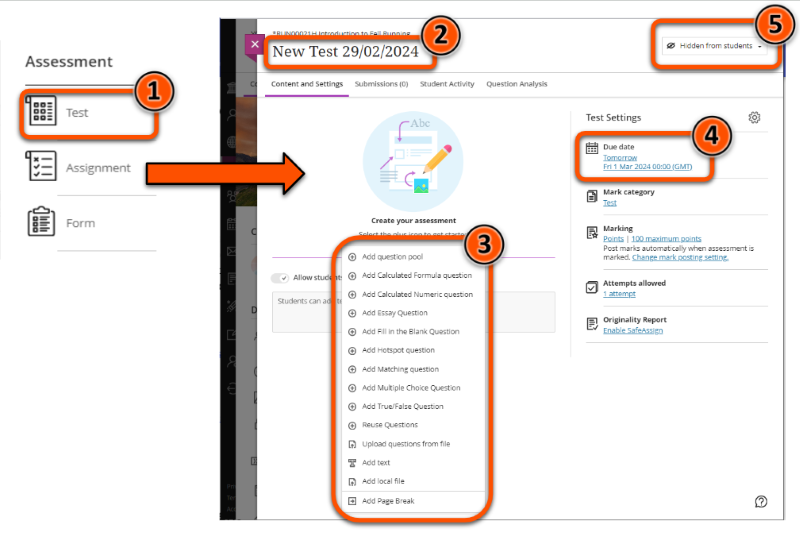

!!! Tip

    You can build and trial the Test in your personal Ultra sandpit site, and when it is ready use the [Copy Content tool](../ultra/copy-content.md) to add it to your module/exam site in the relevant location.

## Add Test questions

There are various ways to add questions to a Test. Which method is most appropriate depends on the amount of questions to add, whether to display all questions or a random subset, and whether questions have already been added elsewhere in the site.

=== "Knowledge check"

    **Suggested method to add questions**

    As knowledge checks have a small number of questions that are all displayed to students, it's likely easiest to **manually add questions** to your Test.

=== "Practice quiz"

    **Suggested method to add questions**

    If all questions are displayed:

    - small number of new questions: manually add questions
    - large number of new questions: upload questions in a .tsv file
    - use questions from another Test or Question Bank: re-use questions

    If subset(s) of possible questions are displayed:

    - add questions to a Question Bank or another Test and then set up a Question Pool(s) in this Test
    
=== "Formal exam"

    **Suggested method to add questions**

    If all questions are displayed:

    - small number of new questions: manually add questions
    - large number of new questions: upload questions in a .tsv file
    - use questions from another Test or Question Bank: re-use questions

    If subset(s) of possible questions are displayed:

    - add questions to a Question Bank or another Test and then set up a Question Pool(s) in this Test
    
### Manually add questions

Add questions individually within the Test interface. You may find it helpful to draft your questions in another document first.

??? question "How to manually add questions"

    1. Click the **plus + icon**.
    2. Select the relevant question type.
      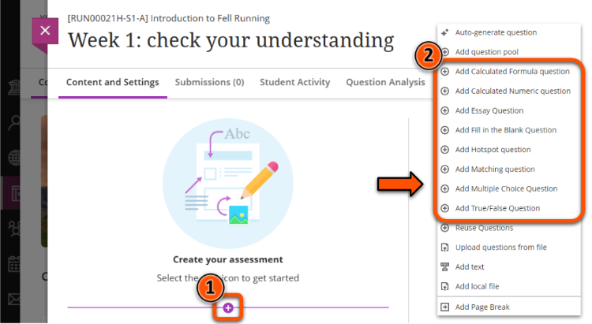
    3. Enter the question and answers as needed for that question type (see the linked guides in the [Question Types section](#question-types) for more information)
    4. Optional question settings (availability depends on question type):
        - set partial or negative credit for different answers
        - set the question as extra credit
        - add automated feedback
        - change the points awarded (default = 1 point)
         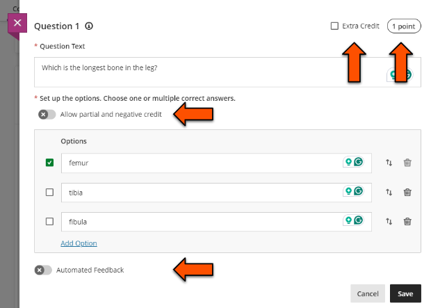
    5. Click **Save**.
    6. Repeat for all questions.

### Auto-generate questions with AI

Use the AI Design Assistant Tool to auto-generate questions based on your site content. The supported question types are:

- Essay (free text response of any length)
- Fill in the Blank
- Matching
- Multiple Choice
- True/False

!!! ai "Using AI tools effectively"

    AI-generated content is a **starting point** for your own content development rather than a finished product.
    
    You must always **carefully check** that output is accurate and appropriate for your intended use and adapt as needed.

??? question "How to auto generate questions"

    1. Create a Test or open an existing Test or Question Bank. To generate a new Question Bank, select **Auto generate** and skip step 2.
    2. Click the **plus icon** where you would like the question(s) to appear, and select **Auto-generate question**.
      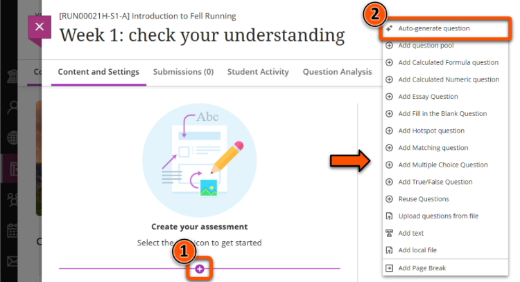
    3. Define the questions:
        - Enter a **Description** and/or **Select course items** to help generate more relevant questions.
        - Select the **Question type** to generate. *Inspire me!* will generate a mix of question types.
        - Set the **Complexity** level and choose how many questions to create.
    4. Click **Generate**.
    5. Review the questions. Select which question(s) to include, or repeat steps 3 and 4 to generate new questions.
    6. Click **Add to Assessment**.
    7. Carefully check the questions for accuracy and appropriacy and edit as needed. 

    If course items are selected to provide context, questions may be based on procedural instructions within an item. If this occurs, you may find it more effective to instead provide a detailed description of the desired content.

    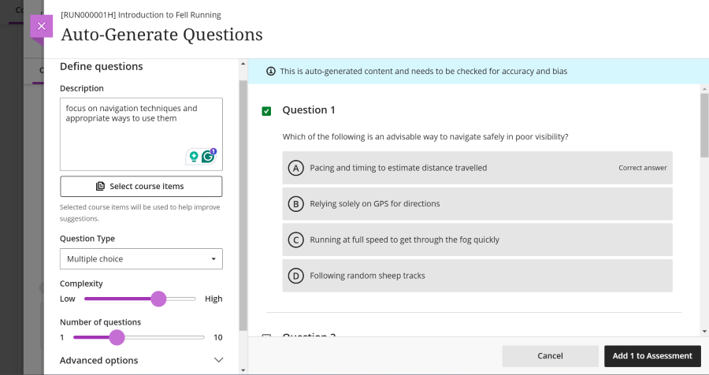

    ??? Abstract "Test questions: interface and examples of generated content"

        **Description:** focus on navigation techniques and appropriate ways to use them

        **Select course items**: none selected

        **Question type**: Multiple choice

        **Complexity:** level 7/10

        **Number of question**: 4 (maximum 10)

        **Content generated:**

        *Question 1.* Which of the following is an advisable way to navigate safely in poor visibility?

        - A. Pacing and timing to estimate distance travelled [Correct answer]
        - B. Relying solely on GPS for directions
        - C. Running at full speed to get through the fog quickly
        - D. Following random sheep tracks

        Further questions are not visible on this screen, scroll to reveal.

### Upload questions from a file

Draft questions in a spreadsheet and **upload them in .tsv format** to your Test. To use optional question settings (eg. partial credit), first upload your file and then manually update each question.

??? question "How to upload questions from a file"

    Prepare the file

    1. Make a copy of the [Ultra tsv template for Tests Google Sheet](https://docs.google.com/spreadsheets/d/17G_QC4bgFbiLmgIFyIl-jOfLbLLFr8yAxCMF3flwGoM/copy)
    2. Enter your questions by editing the *BB test* tab (contains examples of the formatting required for each question type).
     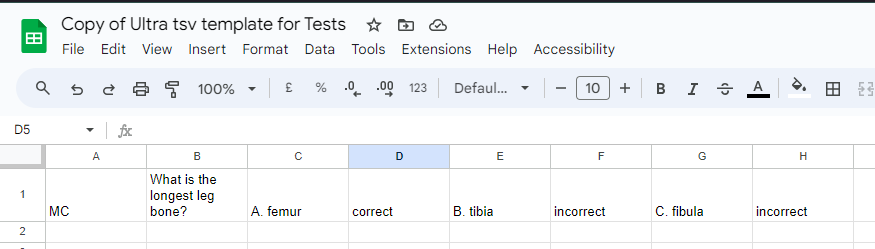
    3. Download the questions in .tsv format: File > Download > Tab-separated values (.tsv)

    Upload the file

    1. Return to the Test and click the **plus + icon**.
    2. Select **Upload questions from file**.
     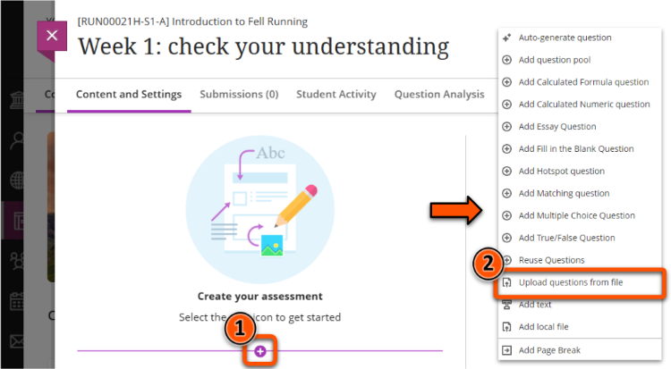
    3. Select your .tsv file.
    4. Once the upload is processed, review the status message for any errors.

    For more details and examples of the required file format, see [Blackboard's guide to uploading questions](https://help.blackboard.com/Learn/Instructor/Ultra/Tests_Pools_Surveys/Reuse_Questions/Upload_Questions).

### Reuse questions

Copy questions that already appear in another Test or Question Bank in the site. This creates copies of questions, so any edits made to re-used questions are not updated in the original question. 

!!! Tip

    Reusing questions will display all of the selected questions in the Test. If you want to display only a subset (eg. 2 of 10 possible questions), use a Question Pool instead.

??? question "How to reuse questions"

    1. Click the **plus + icon**.
    2. Select **Reuse questions**.
     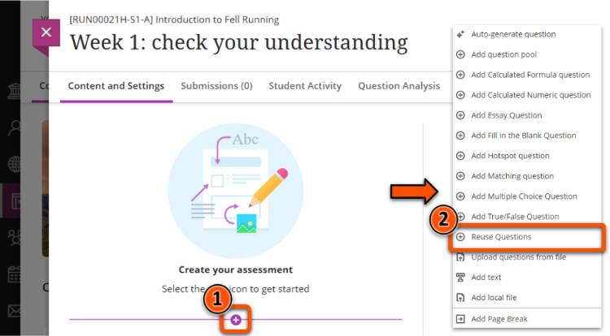
    3. Select the questions to copy, using the filter options if needed: search by keyword, browse by source (Tests and Question Banks), browse by question type.
    4. Click **Copy questions**.
    5. Once the copy is processed, review the status message for any errors.

### Question pools
 
Add a random subset of questions that already appear in another Test or Question Bank in the site. This is useful for creating robust assessments and also for practice quizzes that students may take multiple times.

Question pools do not copy questions; any edits made to questions in a pool will appear everywhere that question is used. Deleting a question from a Question pool does not delete the question in other locations.

!!! Warning

    For fairness and to create a valid assessment, all questions in the pool must be of equivalent difficulty. To include questions at different levels or points values, use multiple pools.

??? question "How to add question pools"

    1. Click the **plus + icon**.
    2. Select **Add question pool**.
     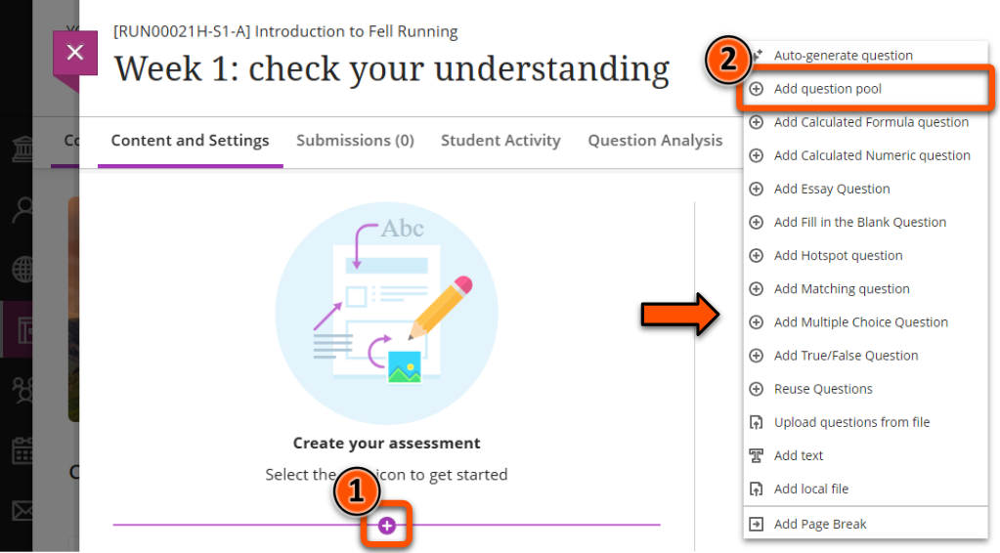
    3. Select the questions to add, using the filter options if needed: search by keyword, browse by source (Tests and Question Banks), browse by question type.
    4. Click **Add questions**.
    5. Enter the number of questions to display and optionally update the points awarded per question. Click **Save**.
     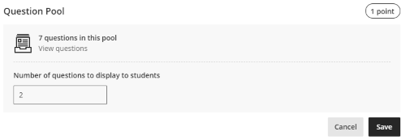
    6. In edit mode a summary of the pool is shown where you can view the questions and edit settings. Students will see the questions pulled from the pool.
     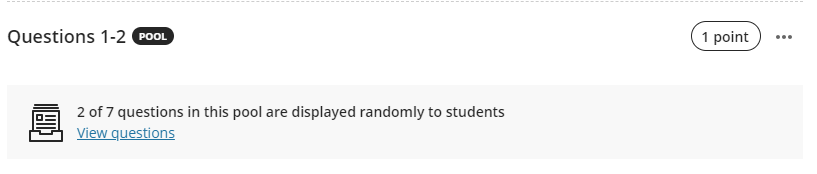

    For more details, see the [BlackBoard Help guide to Question pools](https://help.blackboard.com/Learn/Instructor/Ultra/Tests_Pools_Surveys/ULTRA_Reuse_Questions/Question_Pools).

    <iframe width="560" height="315" src="https://www.youtube.com/embed/cuWBxlV2FVM?si=nJxIyIk57ixUln30" title="YouTube video player" frameborder="0" allow="accelerometer; autoplay; clipboard-write; encrypted-media; gyroscope; picture-in-picture; web-share" allowfullscreen></iframe>
     [Use Question Pools in Assessments in the Ultra Course View [YouTube]](https://youtu.be/cuWBxlV2FVM?si=ulkRHUN9G8-YGIWq)

## Test Settings

There are various settings possible for Tests, including;

- due date and attempt management
- randomising the order of pages, questions and answers
- how marks and feedback are presented to students

!!! Tip

    Randomising questions will display **all questions** in the Test in a random order. If you want to randomly display a subset of questions, use a Question Pool.

Edit settings in the **Assessment settings** panel:

- Click the **cog icon** to open the full Test settings
- The settings summary gives quick access to some settings: Due date, Mark category, Marking, Attempts allowed, Originality Report

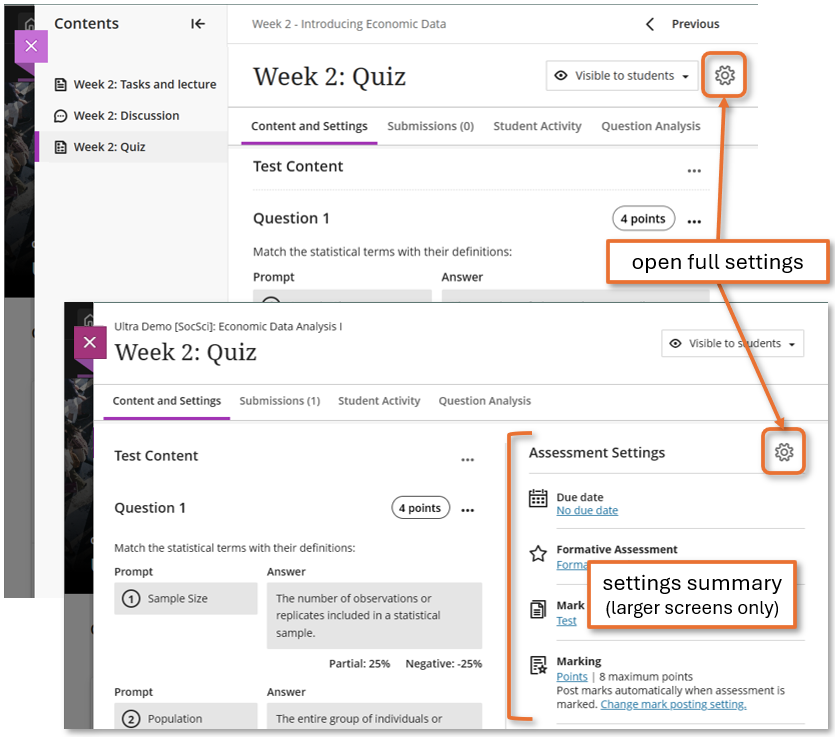

=== "Knowledge check"

    **Suggested settings**

    - Details & Information
        - tick *No due date*
        - leave other options unticked
    - Presentation Options
        - if using LaTeX, tick *Display one question at a time* for more consistent rendering
        - leave other options unticked
    - Formative Tools
        - tick *Formative assessment*
        - leave *Display formative label to students* ticked
    - Marking & Submissions
        - Mark category: leave as *Test* or change to *Quiz* (this will change the icon displayed in the Course Content area)
        - Attempts allowed: set to Unlimited
        - Assessment mark: leave *Post assessment marks automatically* ticked
        - leave other options unticked
    - Assessment results: no action needed
    - Assessment security: no action needed
    - Additional Tools: no action needed
    - Description: add an optional short description to display under the item's name in the Course Content area.

=== "Practice quiz"

    **Suggested settings**

    - Details & Information
        - tick *No due date*
        - leave other options unticked
    - Presentation Options
        - if no randomisation needed: leave all unticked
        - if randomisation is needed: tick *Randomise questions*, *Randomise answers* or *Randomise pages* as desired
        - if using LaTeX, tick *Display one question at a time* for more consistent rendering
    - Formative Tools
        - tick *Formative assessment*
        - leave *Display formative label to students* ticked
    - Marking & Submissions
        - Mark category: leave as *Test* or change to *Quiz* (this will change the icon displayed in the Course Content area)
        - Attempts allowed: set to Unlimited
        - Assessment mark: leave *Post assessment marks automatically* ticked
        - leave other options unticked
    - Assessment results: no action needed
    - Assessment security: no action needed
    - Additional Tools: no action needed
    - Description: add an optional short description to display under the item's name in the Course Content area.
    
=== "Formal exam"

    It's essential that settings are correct for formal exams. This will depend on the structure of your Test and other requirements.
    
    [Contact us](mailto:vle-support@york.ac.uk) to advise on appropriate settings for your specific exam.

## Print or save a Test

You can print or save your Test as a PDF, along with an automatically-generated answer key. This could be useful to:

- deliver and mark the Test as a paper-based assessment
- save the Test for your records
- provide a copy of the Test for external examiners, reviewers etc.

If your Test presents questions in a randomised order and/or contains a Question Pool, a new version of the questions and answer key will be generated each time it is printed. If you want to use same version of the Test instead, save it as PDF and print multiple copies.

To print or save a Test:

1. Open the **Content and Settings** tab in the relevant Test. 
2. Click **Print** above the Test content.
3. Click **Print** in the pop up box.
4. The answer key (shown first) and test are generated and shown in print preview. Save as PDF or send to the printer.

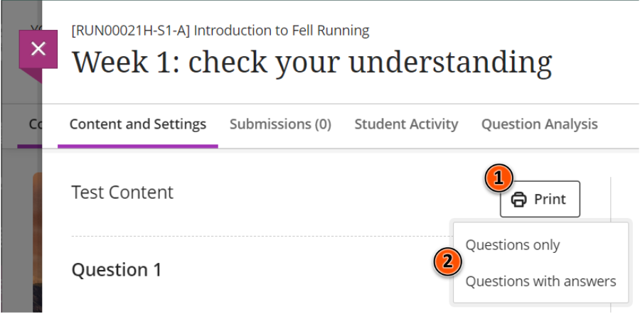
<!-- ## Viewing Test results and analytics -->

