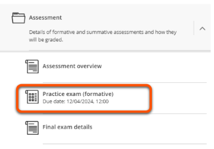

---
tags:
    - Assessment
    - Interactive content
    - Ultra
---

# Test

!!! Summary

    Test is the built-in test engine with various question types with a range of uses from informal knowledge checks to summative exams.

    This guide covers how to use and set up a Test, and is primarily aimed at **teaching staff**.

!!! principle "Relevant [VLE site design principles](../ultra/site-design-principles.md)"

    - 3.4 Essential: Site and materials content is accessible.
    - 4.1 Essential: The assessment section contains all information about module assessments.
    - 4.2 Essential: Assessment instructions are clearly labelled and explain the task and requirements.

## When to use Test

Most question types are automatically marked and so don't need input from teaching staff. This means Tests can be useful in various situations:

- informal self-assessment or knowledge checks within weekly content
- demonstrating preparation for workshops or practicals
- tracking completion of required content (eg. safety materials)
- formative tests/practice exams
- summative exams, either online or in-person (consult us first)

!!! Danger

    You **must** discuss with the Digital Education Team well in advance if you want to run a summative and/or synchronous exam (in person or online) using Ultra Test.
    
    [Contact us](mailto:vle-support@york.ac.uk) to arrange a consultation.

## Robust assessments using Test

Test has various options that can reduce opportunities for collusion and help build a robust assessment: 

- Randomise the order of questions.
- Question banks and pools: present a random selection of questions for each student.
- Multiple Choice and Matching questions: randomise the order of answer options.
- Calculated formula questions: use randomised values to automatically generate different questions for each student.

## Question types

Test allows various question types, most of which are automatically graded.

Key question types:

| Question type | Description |
| ----------- | ----------- |
| [Multiple Choice](https://help.blackboard.com/Learn/Instructor/Ultra/Tests_Pools_Surveys/Question_Types/Multiple_Choice_Questions)  | Pick the correct answer(s) from options given. Options can be fixed or randomised, can give partial or negative credit. |
| [Calculated Formula](https://help.blackboard.com/Learn/Instructor/Ultra/Tests_Pools_Surveys/Question_Types/Calculated_Formula_Questions)  | Calculate the answer to a given formula (eg. 3x + 4y = ?). Values (x/y) are randomly generated so each student has a different question.|
| [Fill in the Blank](https://help.blackboard.com/Learn/Instructor/Ultra/Tests_Pools_Surveys/Question_Types/Fill_in_the_Blank_Questions) | Input the missing word(s) in the given text. |
| [Matching](https://help.blackboard.com/Learn/Instructor/Ultra/Tests_Pools_Surveys/Question_Types/Matching_Questions)| Match corresponding items from two groups. Options can be fixed or randomised, can give partial or negative credit. |

Other available question types include:

- Calculated numeric
- Image Hotspot
- True/False
- Essay or Text input (manually graded)

For more information on which question types are available and how to use them, see [Blackboard's question types guides](https://help.blackboard.com/Learn/Instructor/Ultra/Tests_Pools_Surveys/Question_Types).

## Set up a Test

!!! Warning

    If you are setting up a summative Test, also review this more detailed guide:   
    [Staff Help: Considerations Around & Setting up a **Summative** VLE Test](https://docs.google.com/document/d/1sn85oHTEuxNuw3_6R_TqdGlgrlWAgyCEtv7FXyd0his/edit?usp=sharing)

### Test location
Consider where students would expect the Test to appear.

#### With module materials
Tests used for informal self-tests, knowledge checks or quizzes are best placed alongside the relevant module materials. For example, put a quiz for students to check their understanding of lecture content in the relevant weekly content folder with the lecture materials.

#### In the Assessment section
Tests listed as either a formative or summative assessment in your module catalogue entry should appear (or information about the Test, if run on VLEEXAM) in the Assessment section of the site. If you also want the Test to be accessible through a weekly content folder, use a Course Link.

### Create the Test

!!! Tip

    Draft your Test questions in Google Docs, Word or Excel. This helps avoid errors and it’s useful to have a copy to share with external examiners.

1. In the relevant location, click **Create** > **Test**.
2. Give the Test a descriptive **name** at the top left.
3. Click the plus icon to add **questions** (see below for details of uploading or reusing questions).
4. Set the **Due date** and adjust other settings as needed.
5. Set the test as **Visible to students** or specify  **Release conditions** in the top right.

For more detail, see [Blackboard's guide to setting up Tests](https://help.blackboard.com/Learn/Instructor/Ultra/Tests_Pools_Surveys)

### Upload questions

You can draft questions in a spreadsheet and upload them in .tsv format to your Test:

1. Make a copy of the [Ultra tsv template for Tests Google Sheet](https://docs.google.com/spreadsheets/d/17G_QC4bgFbiLmgIFyIl-jOfLbLLFr8yAxCMF3flwGoM/copy)
2. Enter your questions by editing the BB test tab.
3. Download the questions in tsv format: File > Download > Tab-separated values (.tsv)
4. In your test, click **Upload questions from file** and select your .tsv file.

For more details and examples of the required file format, see [Blackboard's guide to uploading questions](https://help.blackboard.com/Learn/Instructor/Ultra/Tests_Pools_Surveys/Reuse_Questions/Upload_Questions).

### Question pools

Use question pools to present a random subset of questions so that each student gets a different version of the test.

1. Make sure all the questions you want to include have already been added to this Test or another Test or Question Bank on the site.
2. Click **Add question pool**.
3. Select the questions to include in the pool and click **Add questions**.
4. Specify how many questions to display and the points for each question.

<iframe width="560" height="315" src="https://www.youtube.com/embed/cuWBxlV2FVM?si=nJxIyIk57ixUln30" title="YouTube video player" frameborder="0" allow="accelerometer; autoplay; clipboard-write; encrypted-media; gyroscope; picture-in-picture; web-share" allowfullscreen></iframe>
[Use Question Pools in Assessments in the Ultra Course View [YouTube]](https://youtu.be/cuWBxlV2FVM?si=ulkRHUN9G8-YGIWq)

## Accessible Test Content

As with all teaching content, accessibility is very important when building test questions and answer options. [All the usual considerations around accessibility apply to tests](../ultra/accessible-ultra-content.md), but it is **particularly** important that you take into consideration accessiblility when using tables, images or mathematical content in test questions.

- Guidance on creating accessible images, table and maths can be found on [our "Ultra Accessibility" VLE page](https://vle.york.ac.uk/ultra/courses/_106795_1/outline). (Don't have access? [Contact us](mailto:vle-support@york.ac.uk)).
- [Examples of quality alternative text on graphs, diagrams and other complex images can be found here](https://www.routledge.com/our-customers/authors/publishing-guidelines/accessible-content/general-samples).