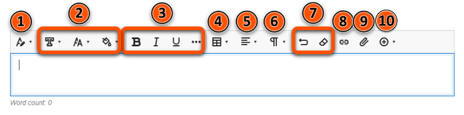
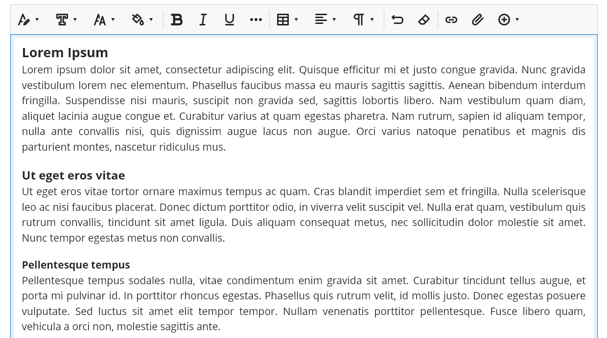
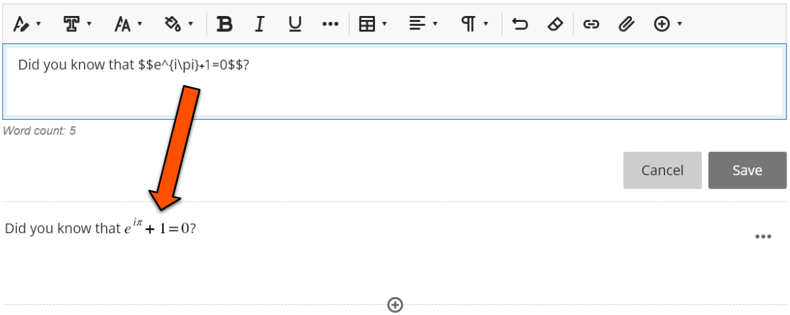

---
tags:
# Delete to leave only relevant tags
    - Foundation
    - Teaching
    - Administration
    - Ultra
---

# The Text Editor

!!! Summary

    The Text Editor provides many tools to enhance the usability and accessibility of content.

!!! principle "Relevant [VLE site design principles](https://vle-support.york.ac.uk/ultra/site-design-principles)"

    - 3.4 Essential: Site and materials content is accessible.

| Label | Tool name | Description |
| ------ | ----------- | ----------- |
| 1 | Text style | Used to format text structure |
| 2 | Font, Font size, Colour picker | Used for formatting text generally (use for **emphasis**, not structure) |
| 3 | Bold, Italic, Underline, Text options (Strikethrough, Superscript, Subscript, Code snippet) | Useful for emphasis of text elements |
| 4 | Create or edit table | Add a table up to 10 by 10 to display data |
| 5 | Alignment options | Change text alignment (generally use **right-aligned** text) |
| 6 | Lists | Add in bullet point or numbered lists |
| 7 | Undo, Clear format | Undo the last change made in the Text Editor or clear formatting from selected text |
| 8 | Link | Add a hyperlink to selected text or add in new text with a hyperlink attached - see our guide on [adding links](https://vle-support.york.ac.uk/ultra/links) |
| 9 | Attachment | Upload files and images between blocks of text see our guides on [adding files](https://vle-support.york.ac.uk/ultra/files) and [adding images](https://vle-support.york.ac.uk/ultra/images) |
| 10 | Insert content (Math, Image, Media, YouTube video, Content Collection, Content Market) | Use various built-in tools to add content seamlessly - see our guide on [adding YouTube videos](https://vle-support.york.ac.uk/ultra/youtube) |

## Adding Text

!!! Warning

    It is important to add text structure through the Styles feature in the Text Editor instead of relying on different font sizes, as the latter information is not conveyed accurately through most screen readers. For more information on creating accessible content, see [the subject guide on Accessibility](https://subjectguides.york.ac.uk/skills/accessibility).

### Video Steps

<iframe width="560" height="315" src="https://www.youtube.com/embed/NDFTG9wd23k" title="YouTube video player" frameborder="0" allow="accelerometer; autoplay; clipboard-write; encrypted-media; gyroscope; picture-in-picture; web-share" allowfullscreen></iframe>

Video: [Adding text in Ultra](https://youtu.be/NDFTG9wd23k).

### Text Steps

1. To add text to an Ultra site, create or open a Document (see our [adding documents guide](https://vle-support.york.ac.uk/ultra/adding-documents)) and click **Add Content**
 
2. Add a heading by clicking the **Styles** tool and clicking **Title** (starting a new line will automatically revert to the paragraph style).
 
3. Continue adding your text, using the **Styles** tool to add section headings.
 
4. You can insert standard LaTeX into text within double dollar signs, and it will render when the text chunk is saved.
 

