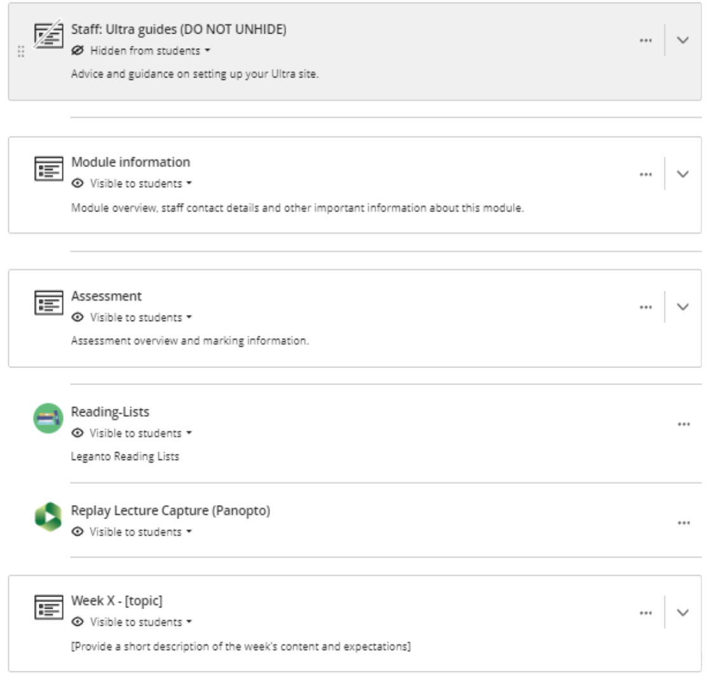

---
tags:
# Delete to leave only relevant tags
    - Key guide - tutors
    - Accessibility
    - Ultra
---

# Using the Ultra template

!!! Summary

    Introducing the structure and content of the Ultra module site template and step-by-step guidance on using it to prepare a site.

!!! principle "Relevant [VLE site design principles](../ultra/site-design-principles.md)"

    - The template supports the principles as a whole.

## Template structure

Each department anmd school has its own dedicated version of the template. However, The Ultra module site template contains 4 main learning modules:

* **Staff Ultra guides** - Advice on building the site
* **Assessment** - Pre-built content & placeholders collating all assessment information
* **Module information** - Placeholders for key module information, pre-built departmental info
* **Module materials section learning module** - add all module content here (slides, quizzes, Padlets etc.)

The template site also contains 2 LTI tools:

* **Reading List**: link to the Reading List tool
* **Panopto Replay content**: Replay Lecture Capture content area for lecture capture recordings

<figure markdown="span">
{: style="height:auto;width:80%;align=centre"}
<figcaption>*Example of an Ultra course template*</figcaption>
</figure>

# Using the content in template

The **staff ultra guides** learning module is designed to help staff easily find resources that can aid development and personalisation of the ultra site from the base template. It is important that the learning module is left on hidden, so students can not see this resoource.

The **module materials section** can appear different in the template dependant on the department. The module materials section learning module can appear in the format of either:

* **Chronological**: Each module materials section contains a week’s worth of readings, assignments,
lecture notes, and discussion forums.
* **By subject area**: Each module materials section contains lecture material and readings on a specific
subject, along with assignments, discussion forums, and tests.
* **By content type**: Similar content types are grouped together in a module materials section (e.g., all
the lectures for the entire course).
<figure markdown="span">

<figcaption>*Example of 3 types of module material layouts*</figcaption>
</figure>
We have placeholders in the module **Information & Assessment** sections these are **required** to be replaced with relevant information and module materials sections there are optional placeholders to help you build your site but feel free to delete them if not relevant. Below demonstrates an example of the placeholder information found in the template documents.

<figure markdown="span">

<figcaption>*Example of placeholder text in template*</figcaption>
</figure>

The **Reading List tool** allows students to access all readings you have setup. If you need to add readings to the tool, please find more advice or help implementing the reading lists on the [ reading list guide page](https://vle-support.york.ac.uk/other-tools/reading-list/). 

The **Panopto LTI tool** allows you to access replays of lecture capture recordings and record videos for the module site. More advice on how to use panopto can be found at the [panopto guide page](../panopto/index.md).

