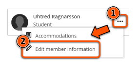
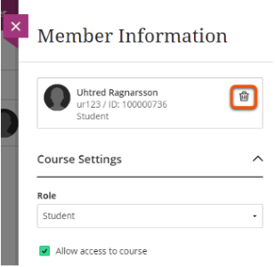
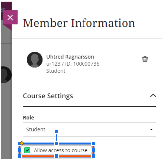

---
tags:
   - Ultra 
   - Advanced
   - Administration
---

# Unenrol a user

!!! Summary

     Users can be manually unenrolled from a Learn Ultra course or organisation. There are different methods depending on whether their data should be deleted or retained.

## Quick Start Guide

These methods can be used to unenrol a user that was manually enrolled on the site.

If a user was automatically enrolled through a Group user (this applies to most students), extra steps are needed to prevent them being re-enrolled again after they are removed. Please contact us at [vle-support@york.ac.uk](mailto:vle-support@york.ac.uk) to unenrol these users. 

<!-- ### Video Steps

Below is an embedded video of unenrolling a user on your Blackboard Learn course or organisation. [Click this link](https://youtu.be/6VFQ88XpJf4) to open this video in another browser tab. Note: If unenrolling a user on an Organisation (rather than a Course), then the Course Role "Leader" is equivalent to "Instructor", and "Participant" is equivalent to "Student".

<iframe width="560" height="315" src="https://www.youtube.com/embed/6VFQ88XpJf4" title="YouTube video player" frameborder="0" allow="accelerometer; autoplay; clipboard-write; encrypted-media; gyroscope; picture-in-picture" allowfullscreen></iframe> -->

### Remove a user and delete their data

1. Under the **Details & Actions** menu, select **Class register/View everyone on your course**. 

2. Locate the user to unenrol using the search function or by finding them in the list.
3. Click the three dots to the right of the user's name and select **Edit member information**. 

4. If the user has a non-Student role, change their role to Student using the drop-down menu. 
5. Click the **dustbin icon** next to the user's name to remove them from the course. 

6. When prompted, click **remove member**. **This cannot be undone**.

!!! Warning

    Removing a user from a course will delete all of their marks, assignment submissions, activity logs and data from the course (eg. posts to Discussions). **This cannot be undone.** To retain the user's data, remove their access to the course instead.

### Remove a user's access but retain their data

1. Under the **Details & Actions** menu, select **Class register/View everyone on your course**. 

2. Locate the user to unenrol using the search function or by finding them in the list.
3. Click the three dots to the right of the user's name and select **Edit member information**. 

4. If the user has a non-Student role, change their role to Student using the drop-down menu.
5. Untick the **Allow access to course** option. 

6. Click **Save**.

## More Details / Troubleshooting 

The error “**Cannot remove Instructor users from course. Only System Administrator users can remove Instructor users**” means that you need to change the user's role from Instructor to Student before removing them.
