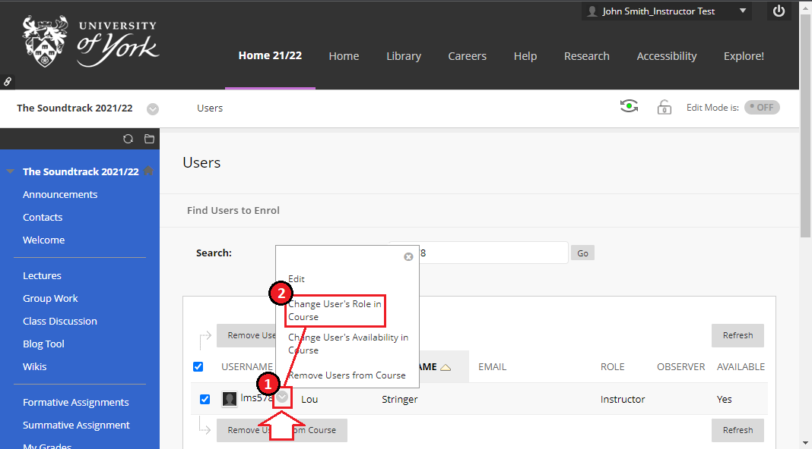

---
tags:
  - Ultra 
  - Advanced
  - Administration
---

# Unenrolling a user from your Blackboard Learn course or organisation UPDATE FOR ULTRA

!!! Summary

    Unenrolling a user from your Blackboard Learn course or organisation will stop them being able to access and view it. If they are enrolled as anything other than a student you must “demote” their course role to Student before unenrolling, or you will receive an error.

!!! Warning

    Unenrolling a student will delete any assignment submissions they have made to the course, and these cannot be retrieved. 
    
    Unenrolling a user will anonymise their contributions, eg. Announcements; posts/comments in journals, blogs, wikis, and discussions; mark up and comments on marking. This cannot be undone.

    If you want a user unenrolled without anonymisation, contact [vle-support@york.ac.uk](mailto:vle-support@york.ac.uk) to request assistance.

## Quick Start Guide

### Video Steps

Below is an embedded video of unenrolling a user on your Blackboard Learn course or organisation. [Click this link](https://youtu.be/6VFQ88XpJf4) to open this video in another browser tab. Note: If unenrolling a user on an Organisation (rather than a Course), then the Course Role "Leader" is equivalent to "Instructor", and "Participant" is equivalent to "Student".

<iframe width="560" height="315" src="https://www.youtube.com/embed/6VFQ88XpJf4" title="YouTube video player" frameborder="0" allow="accelerometer; autoplay; clipboard-write; encrypted-media; gyroscope; picture-in-picture" allowfullscreen></iframe>

### Text Steps

1. **Enter your** Blackboard Learn **course or organisation** as normal
2. Locate the **Control Panel** area of the left hand menu (it’s below your course content)
3. Within the Control Panel, click on **Users and Groups**, then **Users**
4. **Use the search box and filter options **towards the top of the page to find the user you wish to unenrol; 
    1. We recommend picking **Username **and **Contains **in the drop downs, then **pasting in the username** (eg. abc123 - findable via [the University Directory](https://directory.york.ac.uk/)) in the search field and **clicking Go**.

5. **If the user is enrolled as anything other than a student then they must have their course role switched to Student before they can be removed from your course.** If the user is already enrolled as a Student please skip step five.
    2. **Hover your mouse over the user's username** in the results table, click on the **grey circle button** that appears and** select “change user’s role in course”** from the menu.
    

    3. **Click the radio button next to “Student”** and click **Submit**.
6. **Tick the box** the appears to the** left of the username** in the results list
7. Press the **“Remove Users from Course” button** at the top or bottom of the table.

The user will lose access to your course **straight away**, but may continue to receive any announcement emails sent from it for **up to an hour** after removal.

## More Details / Troubleshooting 

* Error “**Cannot remove Instructor users from course. Only System Administrator users can remove Instructor users**” appearing on screen indicates that you have not completed step five of the guidance in this article. 
