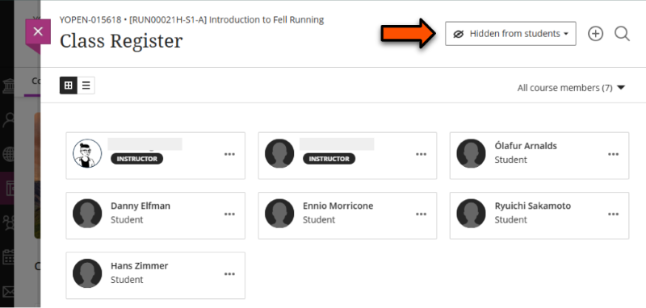
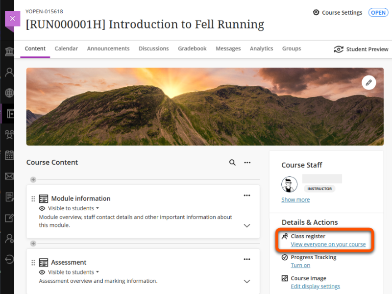
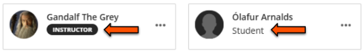
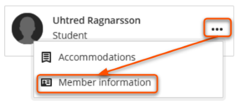
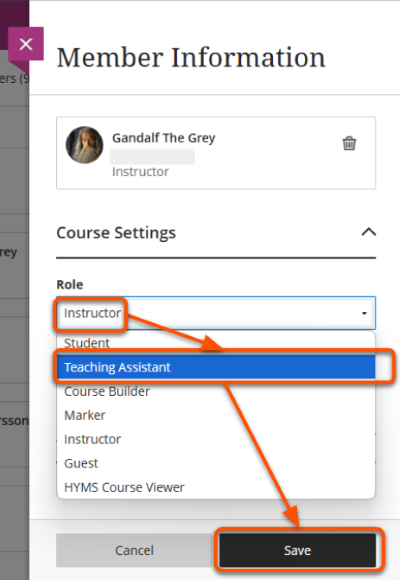
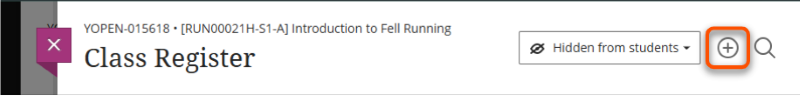
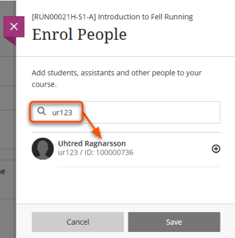
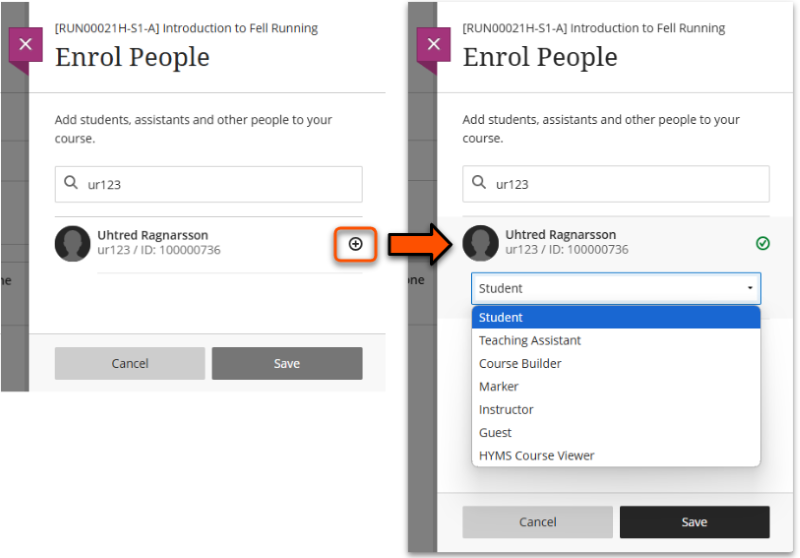
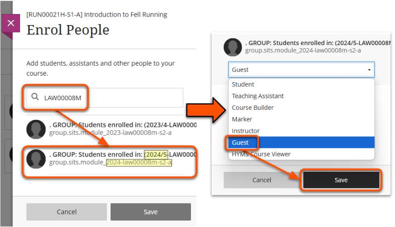
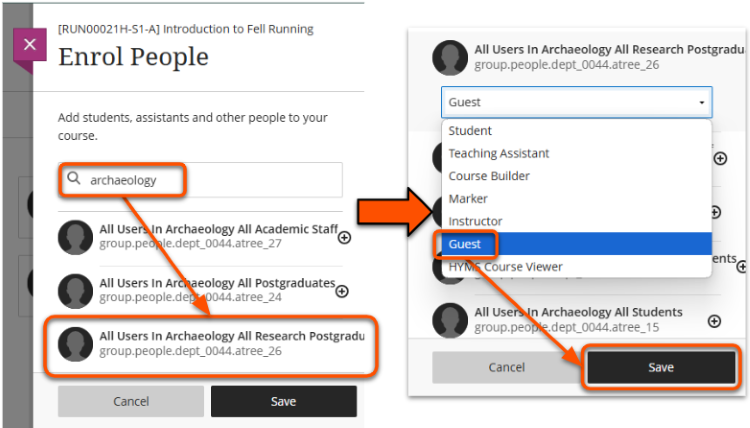

---
tags:
   - Key guide - admin
   - Ultra 
---

# User management

!!! Summary

    Use the Class register to perform tasks such as enrolling and unenrolling users.
    
## Class register

!!! Tip

    The Class Register should be **Hidden from Students**. This is the default setting.

The Class Register lists all users enrolled on the site. This is where you can carry out the user management tasks below.

To access the Class register, click **Class register/View everyone on your course** in the *Details & Actions* panel on the *Course Content* page.

## Course staff: set Primary Instructor

If there are many staff members enrolled on your site, you can allocate *Primary instructor* status to the module staff so they appear at the top of the list. This helps students and support staff to identify the teaching staff.

See the [Course staff guide](course-staff.md) for details.

## User roles

User roles set the permissions for what users can do or see within an Ultra site. For example, whether they can enter closed courses, edit content, or mark student work. Usually staff are given the Instructor role, but there are alternatives if that is not suitable.

There are six main roles, summarised below from the most to the least permissive: 

| Course role (module sites)      | Organisation (Community) equivalent role | Role ideal for            |
| :------           | :------------                 | :----------------------------------- |
| Instructor | Leader | Most academic and admin staff. Has full edit access to the site. |
| Teaching Assistant | Assistant | Staff/GTAs that should have limited access to enrol others, but otherwise act as an Instructor. |
| Marker | Marker | Staff/GTAs who only need to mark student submissions, or who should not have edit access to content. Can't access closed sites. |
| Course Builder | Organisation Builder | Staff/GTAs who only need to build or edit course content. They can't mark student submissions. |
| Student | Participant | Students studying the module, any user that should have read-only access to the site (note: they will appear in the Gradebook). Can't access closed sites. |
| Guest | Guest | **Do not use** - only used for automatic group enrolments (see below). |

For more information on each Role's access level and what they can do, see [our Course Roles spreadsheet](https://docs.google.com/spreadsheets/d/1aCRa_aV3JQrgppSFVRjbyznAJvuEVZTVJEnlo5tLkfc/edit?usp=sharing).

### Guest role: don't use

<!-- One thing to note: when the new data feeds go live (we're hoping for Feb 17th) then the 'Guest' role will disappear from the system, and be replaced by something called 'AutoEnroller' which will be used for SGUs and PGUs. -->

!!! Warning

      **Don't give an individual the Guest role**. The Guest role is not available for individuals, and users assigned this role will not be able to access the site.

The Guest role is used for [automatic enrolments through cohort user groups](#enrol-via-larger-grouping) (aka *SITS Group Users* and *People Group Users*), so you might see *Guest* in your class register - this is correct!

These user groups automatically pull user data from SITS and enrol individual users. For example, this is how students are enrolled on module sites.

### Update a user's role

!!! Warning

    Users that were enrolled via a group user will revert back to the Student role after the next datafeed. [Contact us](mailto:vle-support@york.ac.uk) to update their role for you.

1. Open the **Class Register** and locate the relevant user.
2. Look under their name to check their **Current role**.
 
3. If this needs to be updated, click the **three dots icon** to the right of the user's name and select **Edit member information**.
 
4. Open the *Role drop-down menu* and select the new role, then click **Save**.
 

## Users on Leave of Absence

Students listed as being on a Leave of Absence (LoA) in SITS automatically lose complete access to the VLE within the next 24-48 hours. This means that the student:

- can't log onto the VLE or access module sites.
- doesn't appear in the Class Register, and they can't be manually re-enrolled by departmental staff.
- doesn't appear in the Gradebook and staff can't access any submissions already made.

If needed, we may be able to re-enable the student's access to the VLE and/or specific sites, depending on the situation. For more details, see our guide to [Leave of Absence (LoA) Students and Access to the VLE / Replay Lecture Capture](https://docs.google.com/document/d/1gLyAEIMEfRzzzN2uSot_wKR9AkiHBVu-bxCY6gt5y68/edit?usp=sharing).

## Enrol individual users

!!! Tip
    Students should be enrolled on module sites automatically through their SITS enrollments.

Instructors can manually enrol other users on a site if needed.

1. Open the **Class Register** and click the **plus icon** in the top right.
 
3. On the *Enrol people* panel, search for the user to enrol. As there can be multiple people with the same name, it's best practice to search using their username (abc123) or email so you enrol the correct person.
 
4. Click the **plus icon** next to their name and select the relevant role from the drop down menu. The default **role** is Student.

5. Click **Save**.

Instructors, Teaching Assistants and Course Builders can access the site immediately. Users with other roles have access if the [site is *Open* to students](../ultra/site-availability.md).

### Troubleshooting 

The error *No results found. Check the spelling and try again.* can mean a few things:

1. There's an error in the search term; check and try again.
2. The user is already enrolled on your site and able to access it. Check by searching for them in the class register, using the magnifying glass button in the top right.
3. The user may have been enrolled on the course in the past but then been removed, such as students on LoA. This blocks them from being re-enrolled. [Contact us](mailto:vle-support@york.ac.uk) to re-enrol them for you.

## Enrol a cohort or user group

Student cohort enrolments and larger staff group enrolments are automatically managed through *group users* based on SITS module enrolments (*SITS group users*) or larger cohort groupings (*People Group Users*).

Group enrolments are automatically synchronised with SITS data and staff records. This occurs every morning around 9am, so **enrolments via user groups are not immediate**. For example, new staff members automatically receive access to sites and students going on a Leave of Absence automatically lose access to their module sites. Both enrolment changes occur the day after the source data updates.

### Enrol via module code

To enrol a **SITS group user**:

1. Open the ** Class Register** and click the **plus icon** in the top right.
 
2. Search for the the module code to enrol (eg. LAW00008M)
3. Carefully select the correct group by checking the identifier below the group name for the right year, level, semester and occurrence.
Eg. group name (2024-law00008m-s2-a) = year *2024*, level *m*, semester *s2* and occurrence *a*.
4. In the drop-down menu, select the **Guest** role and then click **Save**.
 

Students enrolled on the module in SITS will be added to the site at the data synchronisation at around 9am the next morning.

### Enrol via larger grouping

There are various **people group users** available for each department, including:

=== "Student group users"

    - all staff and students
    - all students
    - all postgraduates
    - taught postgraduates
    - research postgraduates
    - all undergraduates
    - undergraduates by year (eg. Year 1)

    **Note**: There are no programme or route-level group users.

=== "Staff group users"

    - all staff and students
    - all staff
    - academic staff
    - teaching staff
    - support staff
    - research staff

    **Note**: Staff enrolled via a people group user will be given the Student role.

To enrol a people group user:

1. Open the **Class Register** and click the **plus icon** in the top right.
 
2. Type a cohort keyword like *postgraduate* or *archaeology* to see all the groups available. Carefully select the correct group (see below for tips).
3. In the drop-down menu, select the **Guest** role and then click **Save**.
 

#### Tips for finding the correct group

Group names are often truncated in search results, which can make it hard to identify the one you need. To help find the correct group, you can:

1. **Use a narrow browser window**: resizing may display more of the group name.
2. **Check in the Class Register**: select the group that you think is correct, save and check the group name in the Class Register. If it isn't the correct group, click three dots icon > Member information > dustbin icon to [unenrol the group](#unenrol-a-user) and try again.

## Unenrol a user

These methods can be used to unenrol a user that was manually enrolled on the site.

If a user was automatically [enrolled through a Group user](#enrol-a-cohort-or-user-group) (this applies to most students), extra steps are needed to prevent them being re-enrolled again after they are removed. [Contact us](mailto:vle-support@york.ac.uk) to unenrol these users. 

!!! Warning

    Deleting a user also deletes all of their marks, assignment submissions, activity logs and data from the course. **This cannot be undone.** To retain the user's data, remove their access to the course instead.

1. Open the Class Register and locate the relevant user.
2. Click the **three dots icon** to the right of the user's name and select **Edit member information**.
 
3. If the user has a non-Student role, change their role to Student using the drop-down menu.
4. Use the appropriate method to unenrol the user:
    - *Delete user and all their data*: Click the **dustbin icon** next to the user's name. When prompted, click **Remove Member**. Note that **this cannot be undone**.
    - *Remove a user's access but keep their data*: Untick **Allow access to course** and click **Save**.

### Troubleshooting 

- Error “**Cannot remove Instructor users from course. Only System Administrator users can remove Instructor users**”: change the user's role from Instructor to Student before removing them.
- **User reappears after being unenrolled**: they have likely been automatically reinstated through a group user enrolment. [Contact us](mailto:vle-support@york.ac.uk) to unenrol these users.

## External user access

!!! Warning

    This document details the process as best we understand it, but as we are not experts on the People Database (which is where most of the process occurs) it is possible that our guidance here is not complete.
    
    If you are a People Database Administrator and you’re aware that the below information is incorrect or unclear do please contact us to let us know.

### 1. Set up in the People Database

External users (ie. those without a HR record) need to be set up very specifically in the People Database in order to get access to systems such as the Learn VLE and email. Different settings are required depending on the access required: 

=== "VLE access only"

    To gain access to the VLE your external user(s) will first need temporary People Database accounts creating by the People Database Administrator (PDA) of your Department. 

    1. Locate [your department’s PDA](https://www.york.ac.uk/it-services/help/pda/) and contact them to request the account(s)
    2. Advise your PDA that when they create the account(s) it will need to be set as
        
        i. Associate Type: "External Associate"
        
        ii. Subtype: either "School student/teacher" or "non-accredited student" (**no other subtype will work**). 

=== "VLE and IT account (email etc.)"

    To gain access to the VLE your external user(s) will first need temporary People Database accounts creating by the People Database Administrator (PDA) of your Department. 

    1. Locate [your department’s PDA](https://www.york.ac.uk/it-services/help/pda/) and contact them to request the account(s)
    2. Advise your PDA that when they create the account(s) it will need to be set as
        
        i. Associate Type: "Associate"
        
        ii. Affiliate Type: (whichever is relevant; usually “Staff” is selected for Staff) 

### 2. Register in the VLE

The external user is not automatically notified of the account creation in the People Database, so PDAs need to generate and send the welcome email manually.

The PD should generate a template welcome message that can be sent as an email or printed and posted if needed, etc. This contains a link to [the IDM](https://idm.york.ac.uk/idm/user/login.jsp) and asks the user to register. Registration involves accepting the IT Services Usage Policy/T&Cs etc, setting up security questions, and then changing their ITS password. 

Once registered the external user should then appear within the VLE under the same username within 24-48 hours. As soon as the account appears within the VLE you will be able to enrol the external user on to any required VLE site(s) as usual.