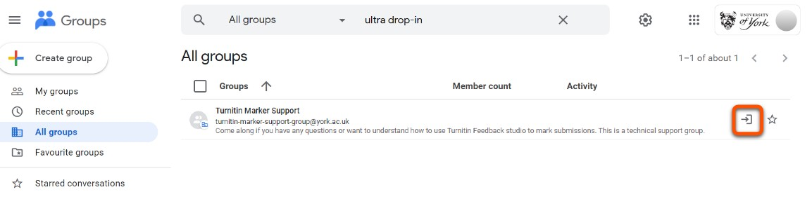
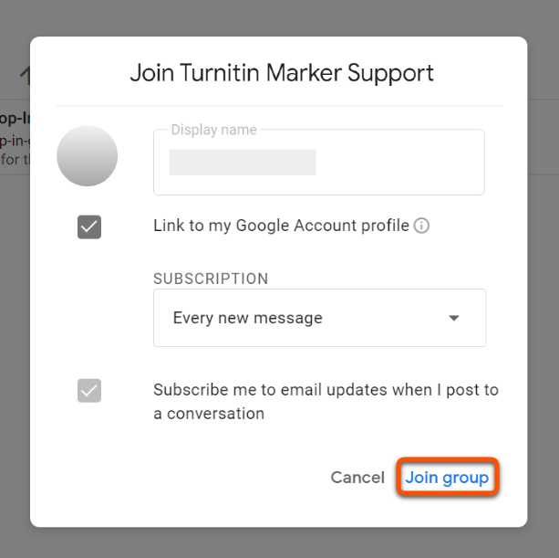

---
tags:
# Delete to leave only relevant tags
    - Foundation
    - Advanced
    - Teaching
    - Administration
    - Ultra
---

# Turnitin Marker Support Drop-in Sessions

We are running regular drop-in sessions for all colleagues using Turnitin Feedback Studio, particularly if you have any questions or want to understand how to use Turnitin Feedback studio to mark submissions. One key thing to note, this is a technical support group. DET staff will be present throughout each session, and can help with:

* General TIFS marker troubleshooting
* Assisting in using specific TIFS marker tools
* Answering any marker related questions you may have

Unlike our other workshops, the signup process is continuous for the drop-in sessions. Anyone signing up via the Google Group will be invited to all future marker drop-ins. Please feel free to indicate your intended attendance at any given session via the calendar invite, but there is no requirement to attend; these sessions are entirely optional for any colleagues who would like additional support.

## Steps to sign up for drop-in sessions

1. Find the [Turnitin Marker Support Google Group](https://groups.google.com/all-groups?q=Turnitin%20Marker)
2. Click the **Join Group** icon
   
3. Click the **Join Group** button at the bottom of the window
   