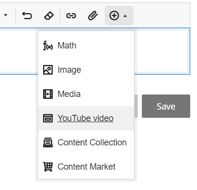
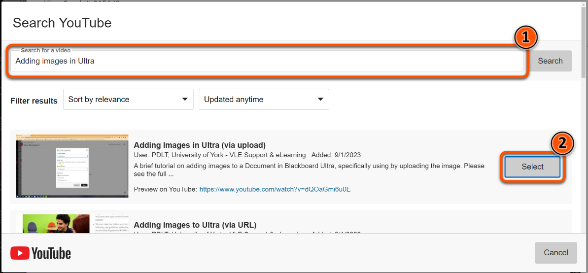
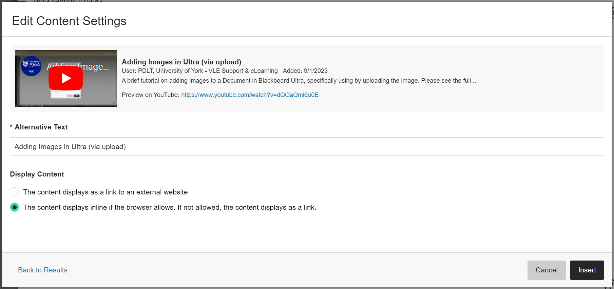
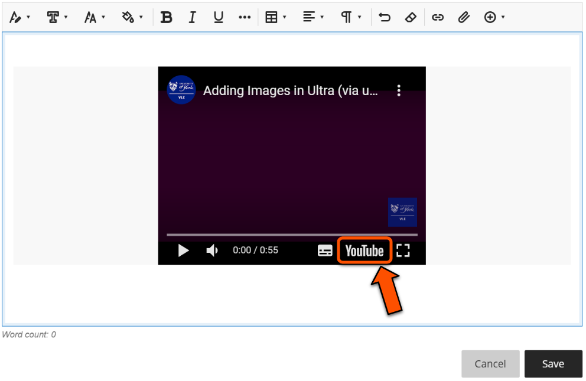
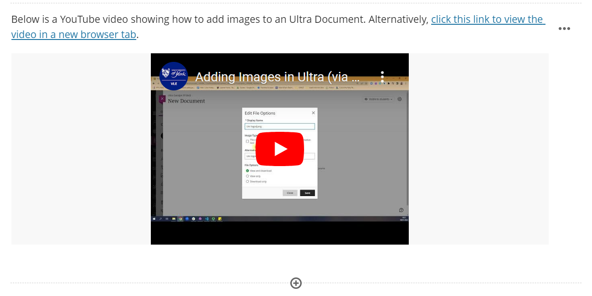

---
tags:
    - Ultra
---

# Embed YouTube videos

!!! Summary

    Embed YouTube videos into Documents using the built-in tool in the text editor or by using a HTML embed code. 

!!! principle "Relevant [VLE site design principles](../ultra/site-design-principles.md)"

    - 3.4 Essential: Site and materials content is accessible.
    - 3.5 Essential: Pre-recorded videos are hosted in a streaming service and captioned accurately.
    - 3.7 Essential: Direct, descriptive links are given to open embedded content (eg. video, Padlet or Xerte objects) in full screen.

!!! Warning

    If you are using an external (ie. non-UoY) video on YouTube, you must:
    
    - only use videos with accurate captions (to meet accessibility requirements)
    - credit the video appropriately in your site (to meet copyright requirements)

## Embed with built-in tool

1. In the text editor, open the "Insert content" drop-down menu and select **YouTube video**

2. Search for the video you'd like to embed and press **Select**

3. Choose the appropriate display options and press **Insert**

4. Open the video in a new tab, then copy the URL of the video.

5. Add in some contextual text for the embedded video, including a [hyperlink](../ultra/links.md/#integrated-hyperlink) to open the video directly. 

Watch a video demonstration:
<iframe width="560" height="315" src="https://www.youtube.com/embed/oDeLtobi36E" title="YouTube video player" frameborder="0" allow="accelerometer; autoplay; clipboard-write; encrypted-media; gyroscope; picture-in-picture; web-share" allowfullscreen></iframe>
Video: [Adding YouTube videos in Ultra](https://youtu.be/oDeLtobi36E).

## Embed with HTML embed code

For more control and customisation, you can embed YouTube videos using a HTML embed code.

1. Find the video you want in YouTube.
2. CLick **Share**, then **Embed** and copy the HTML code (see [YouTube's guide to embed videos](https://support.google.com/youtube/answer/171780?hl=en) for more details)
3. In your Ultra site, use the 'Add HTML' content option and paste in the embed code (see our [guide to embed content](../ultra/embed-content.md) for more details).
4. Using the text editor, add in some contextual text for the embedded video, including a [hyperlink](../ultra/links.md/#integrated-hyperlink) to open the video directly. 